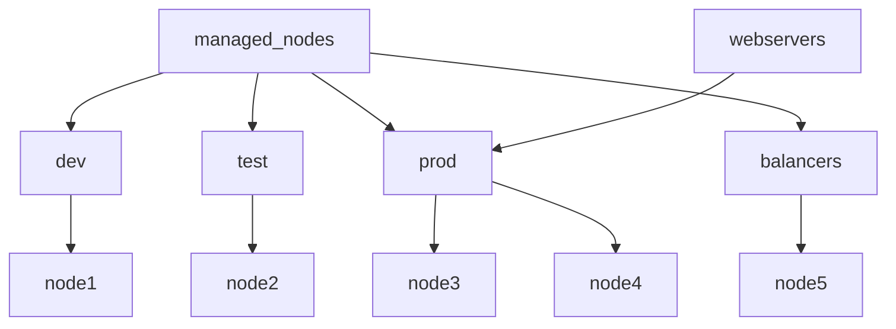

# Ansible Inventory and Configuration Challenge — Five-Node Lab Solution

This solution is written for the personal Rocky Linux 9 Ansible lab.

## Index

1. [Lab information](#1-lab-information)
2. [Step 1 — Log in as ansibleadmin](#2-step-1--log-in-as-ansibleadmin)
3. [Step 2 — Verify or install Ansible](#3-step-2--verify-or-install-ansible)
4. [Step 3 — Create the project structure](#4-step-3--create-the-project-structure)
5. [Step 4 — Create the inventory](#5-step-4--create-the-inventory)
6. [Step 5 — Create ansible.cfg](#6-step-5--create-ansiblecfg)
7. [Step 6 — Verify the project structure](#7-step-6--verify-the-project-structure)
8. [Step 7 — Validate the active configuration](#8-step-7--validate-the-active-configuration)
9. [Step 8 — Validate the inventory](#9-step-8--validate-the-inventory)
10. [Step 9 — Test Ansible connectivity](#10-step-9--test-ansible-connectivity)
11. [Step 10 — Test the normal and privileged users](#11-step-10--test-the-normal-and-privileged-users)
12. [Expected group membership](#12-expected-group-membership)
13. [Important explanations](#13-important-explanations)
14. [Troubleshooting](#14-troubleshooting)
15. [Complete command checklist](#15-complete-command-checklist)

---

## 1. Lab information

| Role | Name | IP address | SSH user |
|---|---|---|---|
| Control node | `ansible-server` | `192.168.1.233` | `ansibleadmin` |
| Managed node | `node1` | `192.168.1.154` | `ansibleadmin` |
| Managed node | `node2` | `192.168.1.185` | `ansibleadmin` |
| Managed node | `node3` | `192.168.1.190` | `ansibleadmin` |
| Managed node | `node4` | `192.168.1.155` | `ansibleadmin` |
| Managed node | `node5` | `192.168.1.156` | `ansibleadmin` |

Project directory:

```text
/home/ansibleadmin/ansible-inventory-lab
```

SSH private key:

```text
/home/ansibleadmin/.ssh/ansible-key
```

---

## 2. Step 1 — Log in as ansibleadmin

If currently logged in as `root`, switch to the Ansible administrator account:

```bash
su - ansibleadmin
```

Confirm the current account:

```bash
whoami
```

Expected output:

```text
ansibleadmin
```

---

## 3. Step 2 — Verify or install Ansible

First check whether Ansible is already installed:

```bash
ansible --version
```

If the command is unavailable, install Ansible from the configured Rocky Linux repositories:

```bash
sudo dnf install ansible -y
```

Verify the installation again:

```bash
ansible --version
ansible-playbook --version
```

> The known control node already has Ansible Core 2.14.18 installed, so reinstalling it should not normally be necessary.

---

## 4. Step 3 — Create the project structure

Create the project, collections, and roles directories:

```bash
mkdir -p /home/ansibleadmin/ansible-inventory-lab/{mycollections,roles}
```

Create the required files:

```bash
touch /home/ansibleadmin/ansible-inventory-lab/{inventory,ansible.cfg}
```

Move into the project directory:

```bash
cd /home/ansibleadmin/ansible-inventory-lab
```

Using a separate directory prevents this exercise from changing the existing `/home/ansibleadmin/automation` project.

---

## 5. Step 4 — Create the inventory

Open the inventory file:

```bash
vim /home/ansibleadmin/ansible-inventory-lab/inventory
```

Enter the following content:

```ini
# Development group
[dev]
node1 ansible_host=192.168.1.154

# Testing group
[test]
node2 ansible_host=192.168.1.185

# Production group
[prod]
node3 ansible_host=192.168.1.190
node4 ansible_host=192.168.1.155

# Load-balancer group
[balancers]
node5 ansible_host=192.168.1.156

# The prod group is a child of webservers
[webservers:children]
prod

# Parent group containing all five managed nodes
[managed_nodes:children]
dev
test
prod
balancers

# Variables inherited by every inventory host
[all:vars]
ansible_user=ansibleadmin
ansible_python_interpreter=/usr/bin/python3
```

Save and close the file.

### Why `ansible_host` is used

The names `node1` through `node5` are inventory aliases. The `ansible_host` variable tells Ansible which IP address it must use for the SSH connection.

For example:

```ini
node1 ansible_host=192.168.1.154
```

- `node1` is the inventory name.
- `192.168.1.154` is the SSH destination.

---

## 6. Step 5 — Create ansible.cfg

Open the configuration file:

```bash
vim /home/ansibleadmin/ansible-inventory-lab/ansible.cfg
```

Enter the following content:

```ini
[defaults]
inventory = /home/ansibleadmin/ansible-inventory-lab/inventory
collections_paths = /home/ansibleadmin/ansible-inventory-lab/mycollections
roles_path = /home/ansibleadmin/ansible-inventory-lab/roles
host_key_checking = True
remote_user = ansibleadmin
ask_pass = False
private_key_file = /home/ansibleadmin/.ssh/ansible-key

[privilege_escalation]
become_method = sudo
become_user = root
become_ask_pass = False
```

Save and close the file.

### Important option names

| Requirement | Configuration option |
|---|---|
| Inventory file | `inventory` |
| Collections directory | `collections_paths` |
| Roles directory | `roles_path` |
| Default SSH user | `remote_user` |
| Private SSH key | `private_key_file` |
| Ask for SSH password | `ask_pass` |
| Privilege-escalation method | `become_method` |
| Privileged account | `become_user` |
| Ask for sudo password | `become_ask_pass` |

> `become = True` is intentionally not set. Privilege escalation will be enabled only when `-b` or `--become` is used. This makes ordinary tests run as `ansibleadmin` while privileged tests run as `root`.

---

## 7. Step 6 — Verify the project structure

Run:

```bash
cd /home/ansibleadmin/ansible-inventory-lab
find . -maxdepth 2 -print
```

Expected structure:

```text
.
./ansible.cfg
./inventory
./mycollections
./roles
```

Confirm ownership:

```bash
ls -ld . inventory ansible.cfg mycollections roles
```

If the files were accidentally created as `root`, correct their ownership:

```bash
sudo chown -R ansibleadmin:ansibleadmin /home/ansibleadmin/ansible-inventory-lab
```

---

## 8. Step 7 — Validate the active configuration

Always run the following commands from the project directory:

```bash
cd /home/ansibleadmin/ansible-inventory-lab
```

Check which configuration file Ansible selected:

```bash
ansible --version
```

The output should contain:

```text
config file = /home/ansibleadmin/ansible-inventory-lab/ansible.cfg
```

Display only settings changed from their defaults:

```bash
ansible-config dump --only-changed
```

Useful individual checks:

```bash
ansible-config dump --only-changed | grep -E 'DEFAULT_HOST_LIST|COLLECTIONS_PATHS|DEFAULT_ROLES_PATH|DEFAULT_REMOTE_USER|DEFAULT_PRIVATE_KEY_FILE|HOST_KEY_CHECKING'
```

The displayed internal names may use uppercase even though the file uses lowercase option names.

---

## 9. Step 8 — Validate the inventory

### Check the inventory syntax and hierarchy

```bash
ansible-inventory --graph
```

The hierarchy should show:

- `node1` under `dev`.
- `node2` under `test`.
- `node3` and `node4` under `prod`.
- `node5` under `balancers`.
- `prod` under `webservers`.
- All four groups under `managed_nodes`.

### Display all parsed inventory data

```bash
ansible-inventory --list
```

### Display variables for every node

```bash
ansible-inventory --host node1
ansible-inventory --host node2
ansible-inventory --host node3
ansible-inventory --host node4
ansible-inventory --host node5
```

Each host should show:

- Its correct `ansible_host` address.
- `ansible_user` set to `ansibleadmin`.
- `ansible_python_interpreter` set to `/usr/bin/python3`.

### List hosts group by group

```bash
ansible dev --list-hosts
ansible test --list-hosts
ansible prod --list-hosts
ansible balancers --list-hosts
ansible webservers --list-hosts
ansible managed_nodes --list-hosts
```

Expected host counts:

| Group | Expected hosts | Count |
|---|---|---:|
| `dev` | `node1` | 1 |
| `test` | `node2` | 1 |
| `prod` | `node3`, `node4` | 2 |
| `balancers` | `node5` | 1 |
| `webservers` | `node3`, `node4` | 2 |
| `managed_nodes` | `node1` through `node5` | 5 |

---

## 10. Step 9 — Test Ansible connectivity

Because `ansible.cfg` specifies the inventory, user, and key, `-i`, `-u`, and `--private-key` are not required when running commands from the project directory.

Test each group:

```bash
ansible dev -m ping
ansible test -m ping
ansible prod -m ping
ansible balancers -m ping
ansible webservers -m ping
ansible managed_nodes -m ping
```

Expected result for every reachable host:

```text
node1 | SUCCESS => {
    "changed": false,
    "ping": "pong"
}
```

The host name changes for each result, but every host should return `SUCCESS` and `pong`.

---

## 11. Step 10 — Test the normal and privileged users

### Run as the normal remote user

```bash
ansible managed_nodes -m command -a "whoami"
```

Every host should return:

```text
ansibleadmin
```

### Escalate to root

```bash
ansible managed_nodes -b -m command -a "whoami"
```

Every host should return:

```text
root
```

Here, `-b` is the short form of `--become`. It enables privilege escalation for that command.

### Verify passwordless sudo directly

If the privileged command fails, test sudo on each managed node:

```bash
ssh -i /home/ansibleadmin/.ssh/ansible-key ansibleadmin@192.168.1.154 'sudo -n whoami'
ssh -i /home/ansibleadmin/.ssh/ansible-key ansibleadmin@192.168.1.185 'sudo -n whoami'
ssh -i /home/ansibleadmin/.ssh/ansible-key ansibleadmin@192.168.1.190 'sudo -n whoami'
ssh -i /home/ansibleadmin/.ssh/ansible-key ansibleadmin@192.168.1.155 'sudo -n whoami'
ssh -i /home/ansibleadmin/.ssh/ansible-key ansibleadmin@192.168.1.156 'sudo -n whoami'
```

`sudo -n` performs a non-interactive sudo test. It succeeds without prompting or fails immediately if a password is required.

---

## 12. Expected group membership



The `prod` group is a child of both `managed_nodes` and `webservers`. This is valid: the same group may be included under multiple parent groups.

---

## 13. Important explanations

### Host group versus parent group

A normal host group contains host entries directly:

```ini
[prod]
node3 ansible_host=192.168.1.190
node4 ansible_host=192.168.1.155
```

A parent group created with `:children` contains the names of other groups:

```ini
[webservers:children]
prod
```

Therefore, targeting `webservers` also targets the hosts inherited from `prod`.

### Why `ansible_python_interpreter` belongs in inventory

`ansible_python_interpreter` is a host variable describing which Python executable Ansible should use on a managed node. Therefore, it belongs in inventory, `group_vars`, or `host_vars`, rather than in the `[defaults]` section of `ansible.cfg`.

### `remote_user` versus `ansible_user`

- `remote_user` in `ansible.cfg` defines a default SSH user.
- `ansible_user` in inventory defines the SSH user for the applicable host or group.
- The inventory variable has higher precedence for those hosts.

Both are included here because the exercise asks for inventory variables and configuration settings. In a real project, unnecessary duplication can be removed.

### Why host-key checking remains enabled

```ini
host_key_checking = True
```

This verifies the managed node's SSH identity and helps protect against connecting to an unexpected system. The first connection may require accepting a new fingerprint.

---

## 14. Troubleshooting

### Problem: Ansible uses the wrong configuration file

Check:

```bash
pwd
ansible --version
```

The current directory should be:

```text
/home/ansibleadmin/ansible-inventory-lab
```

### Problem: Permission denied while using SSH

Check the private key permissions:

```bash
chmod 600 /home/ansibleadmin/.ssh/ansible-key
ls -l /home/ansibleadmin/.ssh/ansible-key
```

Test one node directly:

```bash
ssh -i /home/ansibleadmin/.ssh/ansible-key ansibleadmin@192.168.1.154
```

### Problem: Host-key verification fails

Do not disable checking immediately. Inspect or remove only the outdated entry:

```bash
ssh-keygen -R 192.168.1.154
```

Reconnect manually and verify the fingerprint before accepting it:

```bash
ssh -i /home/ansibleadmin/.ssh/ansible-key ansibleadmin@192.168.1.154
```

Repeat with the appropriate address if another node has the problem.

### Problem: Python interpreter is unavailable

Check it with the `raw` module, which does not require Python on the remote system:

```bash
ansible managed_nodes -m raw -a "command -v python3"
```

### Problem: sudo asks for a password

Test:

```bash
ansible managed_nodes -m command -a "sudo -n whoami"
```

If it fails, passwordless sudo must be configured safely on the affected managed node.

---

## 15. Complete command checklist

Run these commands from top to bottom after creating the two files:

```bash
su - ansibleadmin
mkdir -p /home/ansibleadmin/ansible-inventory-lab/{mycollections,roles}
touch /home/ansibleadmin/ansible-inventory-lab/{inventory,ansible.cfg}
cd /home/ansibleadmin/ansible-inventory-lab

ansible --version
ansible-config dump --only-changed
ansible-inventory --graph
ansible-inventory --list

ansible-inventory --host node1
ansible-inventory --host node2
ansible-inventory --host node3
ansible-inventory --host node4
ansible-inventory --host node5

ansible dev --list-hosts
ansible test --list-hosts
ansible prod --list-hosts
ansible balancers --list-hosts
ansible webservers --list-hosts
ansible managed_nodes --list-hosts

ansible dev -m ping
ansible test -m ping
ansible prod -m ping
ansible balancers -m ping
ansible webservers -m ping
ansible managed_nodes -m ping

ansible managed_nodes -m command -a "whoami"
ansible managed_nodes -b -m command -a "whoami"
```

## Final result

The solution is complete when:

- `ansible --version` selects the project-specific configuration file.
- `ansible-inventory --graph` shows the correct group hierarchy.
- `managed_nodes` lists all five managed nodes.
- Every node returns `pong` from the Ansible `ping` module.
- The normal `whoami` command returns `ansibleadmin`.
- The privileged `whoami` command returns `root`.
