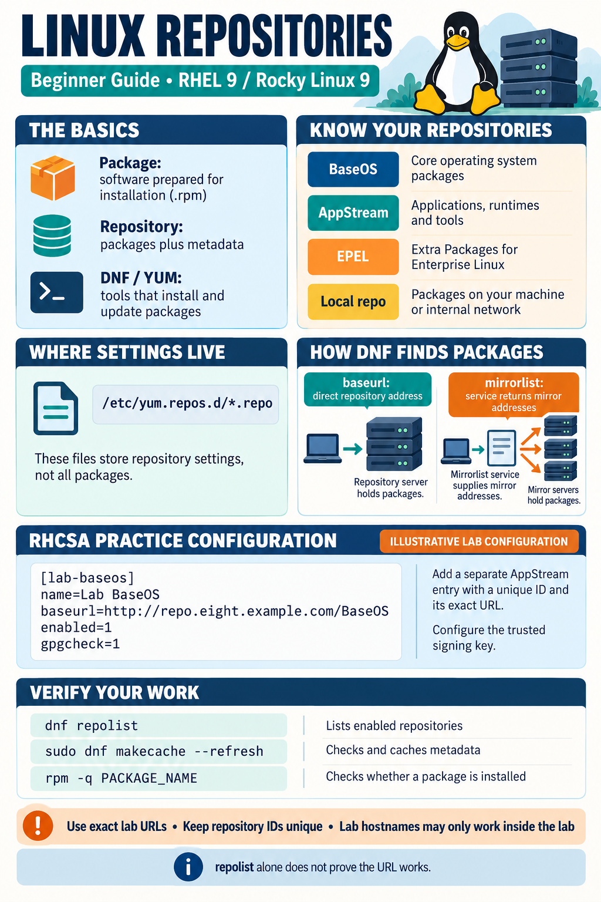

# RHCSA Software Repository Configuration — Complete Study Notes




These notes explain Linux software repositories from the beginning and then apply the concepts to an RHCSA-style repository configuration task on RHEL or Rocky Linux 9.

> The domain names and URLs used in RHCSA exercises often work only inside the exam or training network. Do not expect example addresses such as `repo.eight.example.com` to work from a home lab.

## Table of Contents

1. [Learning objectives](#1-learning-objectives)
2. [What is a software repository?](#2-what-is-a-software-repository)
3. [DNF, YUM, and RPM](#3-dnf-yum-and-rpm)
4. [BaseOS and AppStream](#4-baseos-and-appstream)
5. [How DNF finds packages](#5-how-dnf-finds-packages)
6. [Repository configuration files](#6-repository-configuration-files)
7. [Important repository directives](#7-important-repository-directives)
8. [Inspect the current repository state](#8-inspect-the-current-repository-state)
9. [RHCSA-style repository task](#9-rhcsa-style-repository-task)
10. [Safe step-by-step solution](#10-safe-step-by-step-solution)
11. [Validate only the new repositories](#11-validate-only-the-new-repositories)
12. [Install a package from selected repositories](#12-install-a-package-from-selected-repositories)
13. [DNF cache commands](#13-dnf-cache-commands)
14. [Troubleshooting workflow](#14-troubleshooting-workflow)
15. [Security and GPG verification](#15-security-and-gpg-verification)
16. [Backup and rollback](#16-backup-and-rollback)
17. [Real-job scenario](#17-real-job-scenario)
18. [Common mistakes](#18-common-mistakes)
19. [Command reference](#19-command-reference)
20. [Interview-ready answer](#20-interview-ready-answer)
21. [Practice exercises](#21-practice-exercises)
22. [Completion checklist](#22-completion-checklist)
23. [Review questions](#23-review-questions)

---

## 1. Learning objectives

By the end of this project, you should be able to:

- Explain what a Linux software repository is.
- Explain the roles of DNF, YUM, and RPM.
- Distinguish BaseOS from AppStream.
- Read and create a `.repo` file.
- Explain `mirrorlist`, `baseurl`, `enabled`, `gpgcheck`, and `gpgkey`.
- Configure two repositories using supplied URLs.
- Validate repository metadata without installing a package.
- Force DNF to use only selected repositories.
- Troubleshoot network, DNS, HTTP, metadata, and configuration problems.
- Back up and roll back repository configuration safely.

---

## 2. What is a software repository?

A software repository is a managed location that stores:

- RPM packages;
- package metadata;
- package versions;
- dependency information;
- checksums and signing information.

Think of a repository as a software warehouse. The RPM files are the products, while repository metadata is the warehouse catalog.

When you run:

```bash
sudo dnf install httpd
```

DNF does not search the entire internet randomly. It reads enabled repository definitions, downloads or uses cached metadata, finds the requested package and dependencies, and then downloads the required RPM files.

---

## 3. DNF, YUM, and RPM

| Tool | Purpose |
|---|---|
| `rpm` | Installs, queries, verifies, or removes individual RPM packages at a low level |
| `dnf` | High-level package manager that uses repositories and resolves dependencies |
| `yum` | Compatibility command on modern RHEL/Rocky systems; commonly redirects to DNF |

Examples:

```bash
rpm -q nginx
dnf info nginx
sudo dnf install nginx -y
```

- `rpm -q nginx` checks whether the package is installed.
- `dnf info nginx` displays package information from installed or enabled repository data.
- `dnf install nginx` resolves dependencies and installs the package.

---

## 4. BaseOS and AppStream

RHEL and Rocky Linux 9 use BaseOS and AppStream as major repository groups.

| Repository | Provides | Analogy |
|---|---|---|
| **BaseOS** | Kernel, core libraries, boot components, and essential operating-system tools | The foundation of a house |
| **AppStream** | Applications, languages, runtimes, databases, and additional services | The tools and services placed inside the house |

Both repositories are normally required for a complete system. A package may come from one repository while some of its dependencies come from another.

Check which repository provides a package:

```bash
dnf info bash
dnf info python3
dnf info nginx
```

Look for a field such as `From repo` or `Repository` in the output.

---

## 5. How DNF finds packages

The simplified request flow is:

1. The administrator runs a DNF command.
2. DNF reads configuration under `/etc/dnf/` and `/etc/yum.repos.d/`.
3. DNF selects enabled repositories.
4. DNF obtains repository metadata from a mirror list or direct base URL.
5. DNF searches the metadata for the requested package.
6. DNF calculates required dependencies.
7. DNF downloads the RPM packages.
8. Package signatures are checked when GPG verification is enabled.
9. RPM installs the packages and updates the local RPM database.

```text
dnf command
    ↓
.repo configuration
    ↓
mirrorlist or baseurl
    ↓
repository metadata
    ↓
RPM packages and dependencies
    ↓
signature verification
    ↓
installation
```

---

## 6. Repository configuration files

Repository definitions are normally stored in:

```text
/etc/yum.repos.d/
```

List the files:

```bash
ls -l /etc/yum.repos.d/
```

Important rule:

> A repository configuration filename must end in `.repo`.

Examples:

```text
/etc/yum.repos.d/rocky.repo
/etc/yum.repos.d/redhat.repo
/etc/yum.repos.d/eight.repo
```

A single `.repo` file can contain multiple repository blocks. Every block begins with a repository ID inside square brackets.

```ini
[example-baseos]
name=Example BaseOS
baseurl=http://repo.example.com/BaseOS
enabled=1
gpgcheck=0

[example-appstream]
name=Example AppStream
baseurl=http://repo.example.com/AppStream
enabled=1
gpgcheck=0
```

Repository IDs must be unique across all `.repo` files. Do not create another `[baseos]` block if an enabled repository with that ID already exists.

---

## 7. Important repository directives

| Directive | Meaning |
|---|---|
| `[repo-id]` | Unique identifier used by DNF commands |
| `name=` | Human-readable repository name |
| `baseurl=` | Direct URL of a repository server |
| `mirrorlist=` | URL of a service that returns possible repository mirror addresses |
| `enabled=1` | Repository is enabled and may be used |
| `enabled=0` | Repository exists but is disabled by default |
| `gpgcheck=1` | Verify RPM package signatures |
| `gpgcheck=0` | Do not verify RPM package signatures |
| `gpgkey=` | Location of the trusted public signing key |
| `metadata_expire=` | How long cached metadata may be considered current |

### `mirrorlist` versus `baseurl`

`mirrorlist=` points to a service that gives DNF a list of suitable package servers. The mirror-list service is not itself necessarily the package warehouse.

`baseurl=` sends DNF directly to a specific repository location.

```ini
mirrorlist=https://mirrors.rockylinux.org/mirrorlist?...
```

```ini
baseurl=http://repo.eight.example.com/BaseOS
```

If the exam provides exact repository URLs, use those URLs as `baseurl` values.

### DNF variables

Common variables include:

| Variable | Meaning |
|---|---|
| `$releasever` | Operating-system release used by DNF, such as `9` |
| `$basearch` | Base architecture, such as `x86_64` or `aarch64` |

DNF substitutes these variables automatically. You normally do not replace them manually inside a vendor-provided repository file.

---

## 8. Inspect the current repository state

### 8.1 List enabled repositories

```bash
dnf repolist
```

Example:

```text
repo id              repo name
appstream            Rocky Linux 9 - AppStream
baseos               Rocky Linux 9 - BaseOS
extras               Rocky Linux 9 - Extras
```

### 8.2 List enabled and disabled repositories

```bash
dnf repolist --all
```

### 8.3 Display detailed repository information

```bash
dnf repoinfo
```

### 8.4 Inspect repository configuration

```bash
sudo grep -R --line-number --extended-regexp \
  '^\[|^name=|^baseurl=|^mirrorlist=|^enabled=|^gpgcheck=|^gpgkey=' \
  /etc/yum.repos.d/
```

This displays the important active directives without printing every comment.

### 8.5 Confirm the correct machine

```bash
hostnamectl
whoami
cat /etc/os-release
```

Always confirm the target system before modifying package sources.

---

## 9. RHCSA-style repository task

Example task:

> Configure repositories available from:
>
> `http://repo.eight.example.com/BaseOS`
>
> `http://repo.eight.example.com/AppStream`

The task requires:

- one or more valid `.repo` files;
- two unique repository IDs;
- exact `baseurl` values supplied by the question;
- enabled repositories;
- an appropriate GPG configuration based on the exam instructions and available key;
- successful metadata validation.

The example domain may be reachable only inside the exam environment.

---

## 10. Safe step-by-step solution

### Step 1: Confirm existing IDs

```bash
dnf repolist --all
```

Do not reuse existing IDs such as `baseos` or `appstream`. In this guide, the new IDs are:

```text
eight-baseos
eight-appstream
```

### Step 2: Back up the current repository directory

```bash
timestamp="$(date '+%Y-%m-%d-%H-%M-%S')"
sudo cp -a /etc/yum.repos.d \
  "/root/yum.repos.d.backup-$timestamp"
```

Verify:

```bash
sudo ls -ld "/root/yum.repos.d.backup-$timestamp"
```

### Step 3: Test the supplied locations

```bash
curl -I --max-time 10 http://repo.eight.example.com/BaseOS/
curl -I --max-time 10 http://repo.eight.example.com/AppStream/
```

An HTTP response proves the web server is reachable, but DNF metadata validation is still required. Some repository servers may not support `HEAD`; if `curl -I` is inconclusive, continue with `dnf makecache` and inspect its exact error.

### Step 4: Create the repository file

```bash
sudo vi /etc/yum.repos.d/eight.repo
```

Add:

```ini
[eight-baseos]
name=Eight BaseOS
baseurl=http://repo.eight.example.com/BaseOS
enabled=1
gpgcheck=0

[eight-appstream]
name=Eight AppStream
baseurl=http://repo.eight.example.com/AppStream
enabled=1
gpgcheck=0
```

> `gpgcheck=0` is shown only for a controlled exercise where no key is supplied and the task expects this configuration. In a real environment, use `gpgcheck=1` and configure the approved `gpgkey` whenever signed packages and a trusted key are available.

### Step 5: Check syntax-level details

```bash
sudo cat /etc/yum.repos.d/eight.repo
sudo stat /etc/yum.repos.d/eight.repo
```

Confirm:

- the filename ends in `.repo`;
- both IDs use the intended spelling and case;
- both URLs exactly match the task;
- each directive uses `key=value` syntax;
- there are no duplicate IDs.

### Step 6: Refresh metadata

```bash
sudo dnf clean all
sudo dnf makecache
```

### Step 7: Confirm both repositories

```bash
dnf repolist --all | grep -E 'eight-(baseos|appstream)'
```

Expected conceptually:

```text
eight-appstream    Eight AppStream    enabled
eight-baseos       Eight BaseOS       enabled
```

---

## 11. Validate only the new repositories

To ensure the new repository definitions work independently, temporarily disable every repository and enable only the two new IDs:

```bash
sudo dnf makecache \
  --disablerepo='*' \
  --enablerepo='eight-baseos,eight-appstream'
```

List only the selected repositories:

```bash
dnf repolist \
  --disablerepo='*' \
  --enablerepo='eight-baseos,eight-appstream'
```

Important:

> Repository IDs are exact strings. Use `eight-baseos` and `eight-appstream` consistently. Do not change them to `Eightbaseos`, remove the hyphen, or alter their case.

---

## 12. Install a package from selected repositories

First check whether the package is available:

```bash
dnf info httpd \
  --disablerepo='*' \
  --enablerepo='eight-baseos,eight-appstream'
```

Install it only when the preceding checks are successful:

```bash
sudo dnf install -y httpd \
  --disablerepo='*' \
  --enablerepo='eight-baseos,eight-appstream'
```

Verify the installed RPM:

```bash
rpm -q httpd
```

`rpm -q` confirms package installation in the local RPM database. It does not prove which repository currently provides the package; use DNF information and transaction history for that investigation.

```bash
sudo dnf history info last
```

---

## 13. DNF cache commands

Think of the cache as DNF's saved copy of a store catalog.

| Command | Purpose |
|---|---|
| `dnf clean all` | Removes cached repository metadata and cached packages managed by DNF |
| `dnf makecache` | Downloads fresh metadata for enabled repositories |
| `dnf repolist` | Lists enabled repositories |
| `dnf repolist --all` | Lists enabled and disabled repositories |
| `dnf info PACKAGE` | Shows package information from installed/enabled sources |

After creating or changing a repository definition, these commands make validation clearer:

```bash
sudo dnf clean all
sudo dnf makecache
```

You do not need to run `dnf clean all` before every package installation. DNF normally manages metadata freshness automatically.

---

## 14. Troubleshooting workflow

Troubleshoot from the system outward. Do not change several layers at once.

### 14.1 Confirm interface state

```bash
nmcli device status
ip -br address
```

For a physical or virtual Ethernet interface:

```bash
sudo ethtool enX0 | grep 'Link detected'
```

Replace `enX0` with the actual interface name.

### 14.2 Confirm routing

```bash
ip -4 route
```

Look for a valid default route:

```text
default via 192.168.1.254 dev enX0
```

Test the configured gateway, not an assumed address:

```bash
ping -c 2 192.168.1.254
```

### 14.3 Confirm DNS configuration

```bash
cat /etc/resolv.conf
getent hosts repo.eight.example.com
```

`getent hosts` uses the system's normal name-service configuration, including `/etc/hosts` and DNS according to `/etc/nsswitch.conf`.

If available:

```bash
dig repo.eight.example.com
nslookup repo.eight.example.com
```

On Rocky Linux, `dig` and `nslookup` are provided by `bind-utils`:

```bash
sudo dnf install bind-utils -y
```

This installation itself requires at least one working repository.

### 14.4 Confirm HTTP connectivity

```bash
curl -I --max-time 10 http://repo.eight.example.com/BaseOS/
curl -I --max-time 10 http://repo.eight.example.com/AppStream/
```

Useful interpretations:

| Result | Possible meaning |
|---|---|
| `Could not resolve host` | DNS or hostname problem |
| `Connection timed out` | Routing, firewall, VPN, or remote-server problem |
| `Connection refused` | Host reachable but service not listening on that port |
| `404 Not Found` | URL path may be wrong |
| `200`, `301`, or `302` | Web endpoint responded; continue with DNF metadata test |

### 14.5 Confirm repository IDs and URLs

```bash
sudo cat /etc/yum.repos.d/eight.repo
dnf repolist --all
```

### 14.6 Request verbose DNF diagnostics

```bash
sudo dnf -v makecache \
  --disablerepo='*' \
  --enablerepo='eight-baseos,eight-appstream'
```

Read the first meaningful error. Later messages may be consequences of the original failure.

### 14.7 Common metadata error

If DNF reports that `repomd.xml` cannot be downloaded, possible causes include:

- incorrect `baseurl`;
- missing repository metadata on the server;
- DNS failure;
- routing or firewall failure;
- exam VPN/network not connected;
- proxy requirement;
- repository server unavailable.

---

## 15. Security and GPG verification

`gpgcheck=1` tells DNF to verify that an RPM was signed by a trusted key.

Example secure configuration:

```ini
gpgcheck=1
gpgkey=file:///etc/pki/rpm-gpg/RPM-GPG-KEY-Rocky-9
```

`file://` means the key is stored on the local system.

Important rules:

- Prefer signature verification in real environments.
- Do not disable GPG checking merely because it is easier.
- An exam question that does not print a key does not automatically prove that no suitable key exists on the system.
- Follow the task requirements and inspect available keys.
- Document any approved exception that uses `gpgcheck=0`.

List available RPM-GPG keys:

```bash
ls -l /etc/pki/rpm-gpg/
```

---

## 16. Backup and rollback

### 16.1 Backup before modification

```bash
timestamp="$(date '+%Y-%m-%d-%H-%M-%S')"
sudo cp -a /etc/yum.repos.d \
  "/root/yum.repos.d.backup-$timestamp"
```

### 16.2 Roll back the custom file

Preview the exact target:

```bash
sudo ls -l /etc/yum.repos.d/eight.repo
```

Remove only the custom file:

```bash
sudo rm -f -- /etc/yum.repos.d/eight.repo
```

Refresh metadata:

```bash
sudo dnf clean all
sudo dnf makecache
```

### 16.3 Restore the complete repository directory

Only when a complete rollback is required, select the exact backup directory:

```bash
sudo ls -ld /root/yum.repos.d.backup-*
```

Then restore deliberately. Do not use an unresolved wildcard as the source when multiple backups exist.

Example after replacing the timestamp:

```bash
sudo cp -a \
  /root/yum.repos.d.backup-YYYY-MM-DD-HH-MM-SS/. \
  /etc/yum.repos.d/

sudo dnf clean all
sudo dnf makecache
```

Restoring files does not automatically remove unrelated `.repo` files created after the backup. Review the directory carefully.

---

## 17. Real-job scenario

### Business requirement

A company allows software installation only from approved internal repositories. Another infrastructure team has already built the repository server. The Linux administration team must point managed servers to the approved sources.

### Implementation stages

1. Test the URLs and configuration on one non-production VM.
2. Record the original repository state.
3. Back up current configuration.
4. Create a uniquely named repository file.
5. Validate metadata using only the new repository IDs.
6. Install or query a test package.
7. Collect evidence and application health checks.
8. Convert the proven manual process into Ansible automation.
9. Pilot on a small host group.
10. Roll out in controlled batches.
11. Monitor failures and maintain rollback instructions.

### Why a pilot matters

A syntactically correct `.repo` file can still point to the wrong content, architecture, release, or security key. A pilot validates the complete behavior before a company-wide change.

---

## 18. Common mistakes

### Mistake 1: Duplicate repository IDs

Incorrect approach:

```ini
[baseos]
```

when `[baseos]` already exists elsewhere.

Better:

```ini
[eight-baseos]
```

### Mistake 2: Inconsistent ID spelling

Configured:

```ini
[eight-baseos]
```

Incorrect command:

```bash
--enablerepo=Eightbaseos
```

Correct:

```bash
--enablerepo=eight-baseos
```

### Mistake 3: Assuming example URLs work everywhere

Exam and training domains may be private. Test from the correct exam/lab network.

### Mistake 4: Disabling GPG checking without justification

Use `gpgcheck=0` only when the controlled exercise or approved repository design requires it.

### Mistake 5: Testing with all repositories enabled

The package may come from an old repository, hiding a failure in the new one. Use:

```bash
--disablerepo='*' --enablerepo='eight-baseos,eight-appstream'
```

### Mistake 6: Skipping backup and rollback

Always preserve the original state before editing repository sources.

### Mistake 7: Editing vendor repository files unnecessarily

Prefer a separate, clearly named custom `.repo` file. It is easier to audit and remove.

---

## 19. Command reference

| Command | Purpose |
|---|---|
| `dnf repolist` | List enabled repositories |
| `dnf repolist --all` | List enabled and disabled repositories |
| `dnf repoinfo` | Display repository details |
| `dnf info PACKAGE` | Display package information |
| `dnf clean all` | Clear DNF cache |
| `dnf makecache` | Download fresh metadata |
| `dnf -v makecache` | Refresh metadata with verbose diagnostics |
| `--disablerepo='*'` | Temporarily disable every repository for one command |
| `--enablerepo='ID1,ID2'` | Temporarily enable selected repository IDs |
| `rpm -q PACKAGE` | Query the local RPM database |
| `dnf history info last` | Inspect the latest DNF transaction |
| `getent hosts NAME` | Test system-level hostname resolution |
| `curl -I URL` | Request HTTP headers from a URL |
| `ip -4 route` | Display IPv4 routes and default gateway |
| `nmcli device status` | Show NetworkManager device state |

---

## 20. Interview-ready answer

> First, I would confirm the correct server, operating-system version, network connectivity, and current repository state. I would back up `/etc/yum.repos.d` before making changes. Then I would create a separate `.repo` file with unique repository IDs, the exact BaseOS and AppStream URLs supplied by the task, `enabled=1`, and the appropriate GPG settings. After saving the file, I would clear stale metadata when necessary and run `dnf makecache`. I would then disable all other repositories temporarily and enable only the new IDs to prove that they work independently. Finally, I would query or install a test package, record the evidence, and retain a tested rollback procedure.

---

## 21. Practice exercises

### Exercise 1: Repository discovery

Run:

```bash
dnf repolist
dnf repolist --all
dnf repoinfo
```

Answer:

1. Which repositories are enabled?
2. Which are disabled?
3. Which repository provides `bash`?

### Exercise 2: Configuration reading

Choose one `.repo` file and identify:

- repository ID;
- readable name;
- `mirrorlist` or `baseurl`;
- enabled state;
- GPG-check state;
- GPG-key location.

### Exercise 3: Controlled custom repository

In an authorized lab, create two uniquely named repository blocks using URLs supplied by the instructor. Then validate them with all other repositories disabled.

### Exercise 4: Failure simulation

With a disposable test configuration, introduce one error at a time:

- misspell the hostname;
- use the wrong URL path;
- use the wrong repository ID in `--enablerepo`;
- disable one required repository.

Record the exact error and the command that identified its cause.

---

## 22. Completion checklist

- [ ] Correct VM confirmed
- [ ] OS and release confirmed
- [ ] Current repositories recorded
- [ ] Backup created before modification
- [ ] Repository IDs are unique
- [ ] BaseOS URL matches the task exactly
- [ ] AppStream URL matches the task exactly
- [ ] Repositories are enabled
- [ ] GPG configuration is appropriate and documented
- [ ] `dnf makecache` succeeds
- [ ] New repositories work with all others disabled
- [ ] Test package can be queried or installed
- [ ] DNF transaction evidence collected
- [ ] SELinux remains enforcing unless the task explicitly says otherwise
- [ ] Firewall state remains as required
- [ ] Rollback steps are understood and tested safely

---

## 23. Review questions

1. What is the difference between a repository and an RPM package?
2. What roles do DNF and RPM perform?
3. What is the difference between BaseOS and AppStream?
4. What is the difference between `mirrorlist` and `baseurl`?
5. Why must repository IDs be unique?
6. What does `enabled=1` mean?
7. What security control does `gpgcheck=1` provide?
8. What does `dnf clean all` remove?
9. What does `dnf makecache` download?
10. Why should you test with all unrelated repositories disabled?
11. How would you distinguish a DNS problem from an HTTP-path problem?
12. Why might an RHCSA example URL fail in a home lab?
13. Which command confirms that a package is installed?
14. How would you roll back a custom repository configuration?
15. Why should this change be piloted before company-wide automation?

---

## Final summary

A repository configuration tells DNF where software and metadata are located. A reliable administrator does more than create a `.repo` file: they confirm the correct system, preserve the original state, use unique IDs, validate connectivity and metadata, test the exact repositories independently, keep signature verification enabled whenever possible, and maintain a clear rollback plan.
