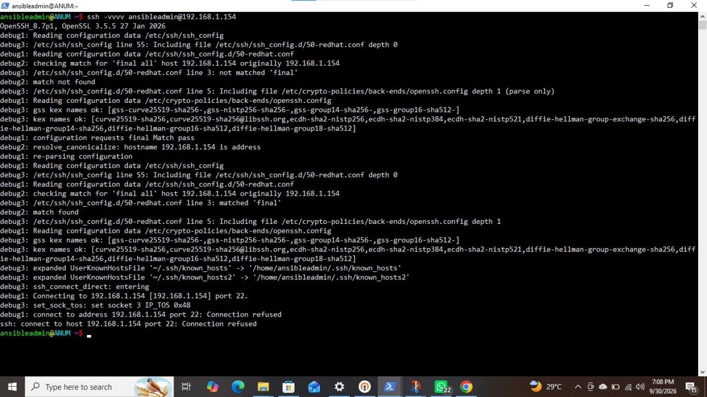
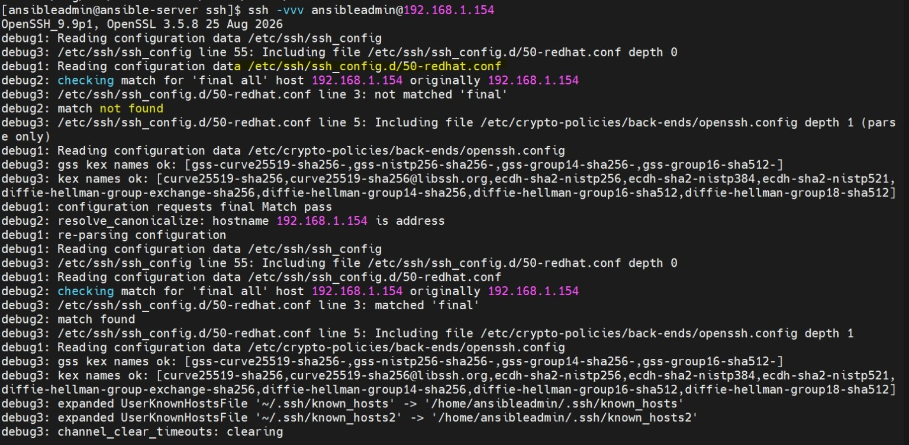
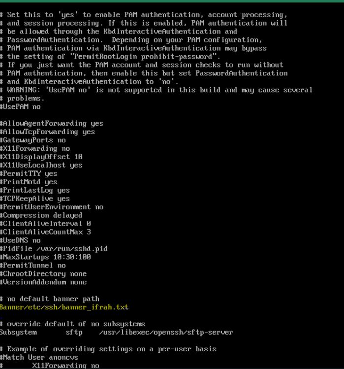

# SSH Connection Refused on Ansible Node1 — Scenario-Based Case Study

This case study documents a real troubleshooting incident in the Ansible lab. It includes the symptoms, investigation, root cause, correction, verification, and lessons learned.

## Lab environment

| Component | Value |
|---|---|
| Control node | `ansible-server.nitclasses.com` |
| Managed node | `node1.nitclasses.com` |
| Node1 IPv4 address | `192.168.1.154` |
| SSH user | `ansibleadmin` |
| Operating system | Rocky Linux 9.8 |
| SSH service | `sshd` |
| SSH port | TCP 22 |

## Index

1. [Scenario](#1-scenario)
2. [Observed symptoms](#2-observed-symptoms)
3. [What Linux ping proved](#3-what-linux-ping-proved)
4. [Testing SSH from two machines](#4-testing-ssh-from-two-machines)
5. [Checking the SSH service from the console](#5-checking-the-ssh-service-from-the-console)
6. [Validating the SSH configuration](#6-validating-the-ssh-configuration)
7. [Root cause](#7-root-cause)
8. [Correction](#8-correction)
9. [Verification](#9-verification)
10. [Testing SSH and Ansible](#10-testing-ssh-and-ansible)
11. [IPv6 duplicate-address warning](#11-ipv6-duplicate-address-warning)
12. [Troubleshooting decision table](#12-troubleshooting-decision-table)
13. [Important lessons](#13-important-lessons)
14. [Recommended safe workflow](#14-recommended-safe-workflow)
15. [Practice questions](#15-practice-questions)

---

## 1. Scenario

Normal network ping to `node1` was successful, but Ansible could not reach it. Because Ansible uses SSH by default, the next step was to test SSH directly.

The expected Ansible command was:

```bash
ansible node1 -m ping
```

However, Ansible could not complete its connection because the SSH daemon on `node1` was not running successfully.

---

## 2. Observed symptoms

The important distinction was:

- Linux `ping` succeeded.
- SSH to TCP port 22 failed.
- Ansible `ping` therefore also failed.

Ansible's `ping` module is not an ICMP network ping. It normally requires:

1. network reachability;
2. a working SSH service;
3. correct SSH credentials;
4. a usable Python interpreter on the managed node;
5. successful Ansible module execution.

---

## 3. What Linux ping proved

A successful command such as:

```bash
ping -c 4 192.168.1.154
```

proved only that the destination responded to ICMP traffic. It did **not** prove that:

- SSH was running;
- TCP port 22 was open;
- the username or private key was correct;
- Python was available;
- Ansible could execute a module.

This explains why Linux ping can work while Ansible ping fails.

---

## 4. Testing SSH from two machines

SSH was tested directly with verbose output:

```bash
ssh -vvv ansibleadmin@192.168.1.154
```

### Client machine 1



Important output:

```text
Connecting to 192.168.1.154 [192.168.1.154] port 22.
connect to address 192.168.1.154 port 22: Connection refused
ssh: connect to host 192.168.1.154 port 22: Connection refused
```

### Client machine 2



Both tests failed before authentication. Therefore, the private key and password were not yet the primary issue.

### Meaning of `Connection refused`

`Connection refused` normally means:

- the destination machine is reachable;
- the TCP connection reached the destination;
- but no service is accepting the connection on that port, or a firewall is actively rejecting it.

This result directed the investigation toward the SSH daemon on `node1`.

---

## 5. Checking the SSH service from the console

Because remote SSH access was unavailable, `node1` was accessed through its direct VM console. The following command was run:

```bash
systemctl status sshd
```


Important output:

```text
Loaded: loaded (.../sshd.service; enabled; preset: enabled)
Active: activating (auto-restart) (Result: exit-code)
ExecStart=/usr/sbin/sshd -D $OPTIONS (code=exited, status=255/EXCEPTION)
Main PID: ... (code=exited, status=255/EXCEPTION)
```

### Interpretation

| Output | Meaning |
|---|---|
| `enabled` | The service is configured to start at boot |
| `activating (auto-restart)` | systemd is repeatedly trying to restart it |
| `Result: exit-code` | The service process terminated with an error |
| `status=255/EXCEPTION` | `sshd` rejected something during startup |

An enabled service is not necessarily a running service. The desired state was:

```text
Active: active (running)
```

---

## 6. Validating the SSH configuration

The SSH configuration was validated before making more changes:

```bash
/usr/sbin/sshd -t
```


The command reported:

```text
/etc/ssh/sshd_config line 120: no argument after keyword "Banner/etc/ssh/banner_ifrah.txt"
/etc/ssh/sshd_config: terminating, 1 bad configuration options
```

This was the decisive diagnostic evidence. The problem was in `/etc/ssh/sshd_config`, not in Ansible.

### Why `sshd -t` is important

`sshd -t` tests the SSH server configuration without starting a new daemon. Normally:

- no output means the syntax is valid;
- output indicates a configuration error that must be corrected.

---

## 7. Root cause

The banner directive was written incorrectly:

```text
Banner/etc/ssh/banner_ifrah.txt
```



The directive name and its argument must be separated by whitespace.

Incorrect:

```text
Banner/etc/ssh/banner_ifrah.txt
```

Correct:

```text
Banner /etc/ssh/banner_ifrah.txt
```

Because the line had no separating space, `sshd` treated the complete text as a keyword. It could not parse the configuration, exited with status 255, and stopped listening on TCP port 22.

The complete failure chain was:

```text
Malformed Banner line
        ↓
sshd configuration validation failed
        ↓
sshd service could not start
        ↓
Nothing listened on TCP port 22
        ↓
SSH returned Connection refused
        ↓
Ansible could not reach node1
```

---

## 8. Correction

### Temporary recovery

The invalid line was first commented out:

```text
#Banner/etc/ssh/banner_ifrah.txt
```

This allowed `sshd` to ignore the malformed directive and start again. However, the SSH banner remained disabled.

### Correct permanent configuration

The recommended configuration is:

```text
Banner /etc/ssh/banner_ifrah.txt
```

Before editing, create a backup:

```bash
cp -p /etc/ssh/sshd_config /etc/ssh/sshd_config.backup
```

Open the relevant line:

```bash
vim +120 /etc/ssh/sshd_config
```

Ensure the banner file exists:

```bash
ls -l /etc/ssh/banner_ifrah.txt
```

If necessary, create it:

```bash
echo "WARNING: AUTHORIZED ACCESS ONLY." > /etc/ssh/banner_ifrah.txt
chown root:root /etc/ssh/banner_ifrah.txt
chmod 0644 /etc/ssh/banner_ifrah.txt
```

Validate the configuration:

```bash
/usr/sbin/sshd -t
```

Only continue when this command returns no output.

Apply the valid configuration:

```bash
systemctl reload sshd
```

If the service is already stopped, use:

```bash
systemctl restart sshd
```

---

## 9. Verification

After removing the malformed line, the service started successfully:


Important output:

```text
Active: active (running)
Server listening on 0.0.0.0 port 22.
Server listening on :: port 22.
Started OpenSSH server daemon.
```

The validation command also returned no error:

```bash
/usr/sbin/sshd -t
```

Confirm the listener:

```bash
ss -ltnp | grep ':22'
```

Expected examples:

```text
LISTEN ... 0.0.0.0:22 ... sshd
LISTEN ... [::]:22    ... sshd
```

---

## 10. Testing SSH and Ansible

From the Ansible control node, test SSH first:

```bash
ssh -i ~/.ssh/ansible-key ansibleadmin@192.168.1.154
```

After successful SSH login, test Ansible:

```bash
ansible node1 -m ping
```

Expected result:

```text
node1 | SUCCESS => {
    "changed": false,
    "ping": "pong"
}
```

If SSH works but Ansible still fails, use verbose output:

```bash
ansible node1 -m ping -vvv
```

Also inspect the host variables:

```bash
ansible-inventory --host node1
```

---

## 11. IPv6 duplicate-address warning

The console also showed messages similar to:

```text
IPv6: enX0: IPv6 duplicate address ... detected!
```

This indicates that the same IPv6 address was detected elsewhere on the network. It is a separate network issue and was not the confirmed cause of this SSH failure.

The confirmed SSH cause was the malformed `Banner` directive reported by `sshd -t`.

The IPv6 issue can be investigated separately with:

```bash
ip -6 address show dev enX0
ip -6 route
nmcli device show enX0
journalctl -k | grep -i 'duplicate address'
```

Do not mix an unrelated warning with the verified root cause. Troubleshooting should follow evidence.

---

## 12. Troubleshooting decision table

| Test result | Likely meaning | Next step |
|---|---|---|
| Linux ping fails | Network, routing, address, or ICMP issue | Check IP, interface and route |
| `Connection refused` | Host reachable, but port closed or service not listening | Check `systemctl status sshd` |
| `Connection timed out` | Traffic may be dropped or path unavailable | Check firewall and routing |
| SSH asks for password | SSH works; key authentication is not being used | Check key and `authorized_keys` |
| `Permission denied (publickey)` | Key authentication failed | Check user, key, permissions and logs |
| SSH works, Ansible fails | Inventory, Python, or Ansible configuration issue | Run `ansible ... -vvv` |
| `sshd -t` reports an error | Invalid SSH server configuration | Correct the specified line |
| `sshd -t` has no output | Configuration syntax is valid | Reload or restart `sshd` |

---

## 13. Important lessons

1. Successful Linux ping does not guarantee successful SSH or Ansible access.
2. Ansible normally depends on SSH, so test SSH before troubleshooting Ansible modules.
3. `Connection refused` indicates a different problem from authentication failure.
4. `enabled` and `active (running)` are different service states.
5. Always run `sshd -t` before reloading or restarting SSH.
6. A single missing space in `sshd_config` can stop all remote SSH access.
7. Keep direct console access available while changing SSH configuration.
8. Create a backup before editing important configuration files.
9. Follow the exact error message instead of guessing.
10. Separate unrelated warnings from the verified root cause.

---

## 14. Recommended safe workflow

Whenever modifying `/etc/ssh/sshd_config`, use this order:

```bash
# 1. Back up the current configuration
cp -p /etc/ssh/sshd_config /etc/ssh/sshd_config.backup

# 2. Edit the configuration
vim /etc/ssh/sshd_config

# 3. Validate before applying it
/usr/sbin/sshd -t

# 4. Reload only if validation succeeds
/usr/sbin/sshd -t && systemctl reload sshd

# 5. Confirm service and listener
systemctl status sshd --no-pager
ss -ltnp | grep ':22'

# 6. Test from a separate terminal
ssh ansibleadmin@192.168.1.154
```

Do not close an existing remote SSH session until a new session has connected successfully.

---

## 15. Practice questions

1. Why could Linux ping succeed while Ansible ping failed?
2. What does `Connection refused` tell you?
3. What is the difference between `enabled` and `active (running)`?
4. Why did `sshd` exit with status 255?
5. What was wrong with `Banner/etc/ssh/banner_ifrah.txt`?
6. What does `/usr/sbin/sshd -t` do?
7. Why should the configuration be tested before restarting SSH?
8. When should `reload` be preferred over `restart`?
9. Why was the IPv6 duplicate-address warning not considered the confirmed SSH root cause?
10. Which command should be tested first after restoring SSH but before testing Ansible?

## Final diagnosis

The managed node was network-reachable, but its SSH daemon could not start because of an invalid banner directive in `/etc/ssh/sshd_config`. Correcting the directive and validating the configuration restored the SSH listener on TCP port 22, allowing SSH and Ansible communication to resume.
