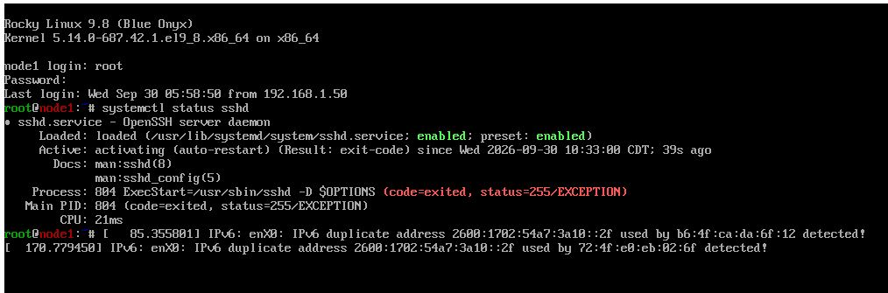
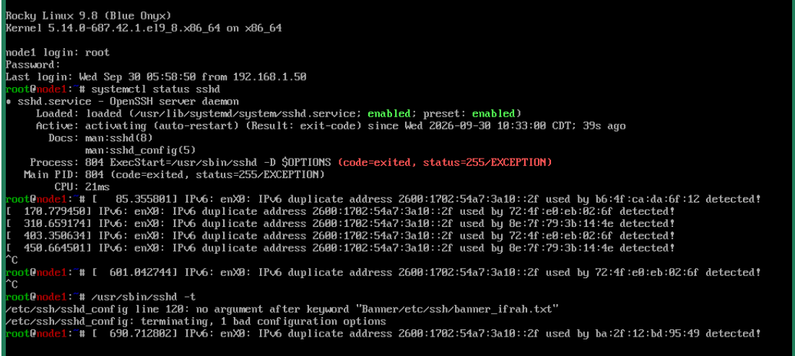
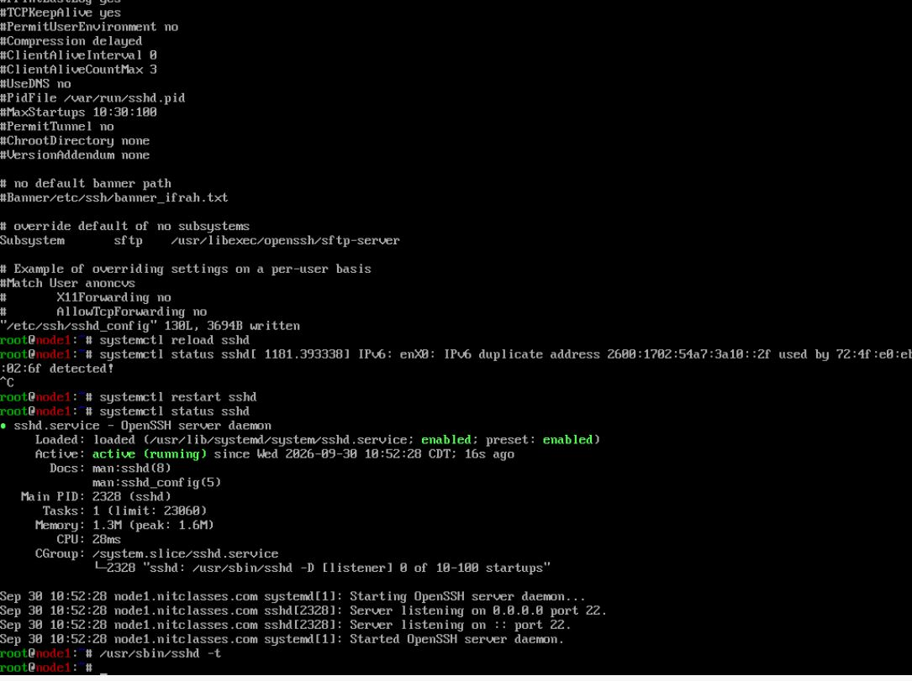

# Ansible Node1 Par SSH Connection Refused — Scenario-Based Study Notes

Yeh case study hamare real Ansible lab incident ko document karti hai. Is mein problem ka scenario, screenshots, important output ki transcription, diagnosis, root cause, solution aur verification shamil hain.

## Lab environment

| Component | Value |
|---|---|
| Control node | `ansible-server.nitclasses.com` |
| Managed node | `node1.nitclasses.com` |
| Node1 IPv4 address | `192.168.1.154` |
| SSH user | `ansibleadmin` |
| Operating system | Rocky Linux 9.8 |
| SSH service | `sshd` |
| SSH port | TCP 22 |

## Index

1. [Scenario](#1-scenario)
2. [Nazar aane wali symptoms](#2-nazar-aane-wali-symptoms)
3. [Linux ping ne kya prove kiya?](#3-linux-ping-ne-kya-prove-kiya)
4. [Do machines se SSH test](#4-do-machines-se-ssh-test)
5. [Console se SSH service check karna](#5-console-se-ssh-service-check-karna)
6. [SSH configuration validate karna](#6-ssh-configuration-validate-karna)
7. [Asal root cause](#7-asal-root-cause)
8. [Correction aur recovery](#8-correction-aur-recovery)
9. [Solution verify karna](#9-solution-verify-karna)
10. [SSH aur Ansible test karna](#10-ssh-aur-ansible-test-karna)
11. [IPv6 duplicate-address warning](#11-ipv6-duplicate-address-warning)
12. [Troubleshooting decision table](#12-troubleshooting-decision-table)
13. [Aham lessons](#13-aham-lessons)
14. [Recommended safe workflow](#14-recommended-safe-workflow)
15. [Practice questions](#15-practice-questions)

---

## 1. Scenario

`node1` ko normal Linux `ping` successfully ho raha tha, lekin Ansible us tak nahin pohanch raha tha. Ansible default tor par SSH use karta hai, is liye agla logical step direct SSH connection test karna tha.

Ansible command:

```bash
ansible node1 -m ping
```

Yeh command complete nahin ho rahi thi kyun ke `node1` par SSH daemon successfully run nahin kar raha tha.

---

## 2. Nazar aane wali symptoms

Teen important observations theen:

- Linux `ping` successful tha.
- TCP port 22 par SSH connection fail tha.
- Is wajah se Ansible `ping` bhi fail tha.

Ansible ka `ping` module Linux ke ICMP `ping` jaisa nahin hota. Aam tor par Ansible ping ke liye yeh cheezen zaroori hoti hain:

1. managed node tak network reachability;
2. working SSH service;
3. sahi SSH username aur authentication;
4. managed node par usable Python interpreter;
5. Ansible module ki successful execution.

---

## 3. Linux ping ne kya prove kiya?

Example:

```bash
ping -c 4 192.168.1.154
```

Successful Linux ping ne sirf yeh prove kiya ke destination ICMP packets ka response de raha hai. Is ne yeh prove nahin kiya ke:

- SSH service run kar rahi hai;
- TCP port 22 open hai;
- username ya private key sahi hai;
- Python available hai;
- Ansible module execute ho sakta hai.

Isi liye Linux ping successful ho sakta hai jab ke Ansible ping fail ho.

---

## 4. Do machines se SSH test

SSH ko verbose mode mein test kiya gaya:

```bash
ssh -vvv ansibleadmin@192.168.1.154
```

### Client machine 1


Important output:

```text
Connecting to 192.168.1.154 [192.168.1.154] port 22.
connect to address 192.168.1.154 port 22: Connection refused
ssh: connect to host 192.168.1.154 port 22: Connection refused
```

### Ansible control node


Dono tests authentication shuru hone se pehle fail ho gaye. Is stage par private key ya password primary problem nahin the.

### `Connection refused` ka matlab

`Connection refused` aam tor par batata hai ke:

- destination machine reachable hai;
- TCP request destination tak pohanch gayi;
- lekin us port par koi service connection accept nahin kar rahi, ya firewall actively reject kar raha hai.

Is result ne investigation ko `node1` ki SSH service ki taraf direct kiya.

---

## 5. Console se SSH service check karna

Remote SSH available nahin tha, is liye `node1` ke direct VM console se login kiya gaya. Phir yeh command chalayi gayi:

```bash
systemctl status sshd
```



Important output:

```text
Loaded: loaded (.../sshd.service; enabled; preset: enabled)
Active: activating (auto-restart) (Result: exit-code)
ExecStart=/usr/sbin/sshd -D $OPTIONS (code=exited, status=255/EXCEPTION)
Main PID: ... (code=exited, status=255/EXCEPTION)
```

### Output ki explanation

| Output | Roman Urdu explanation |
|---|---|
| `enabled` | Service boot ke waqt start hone ke liye configured hai |
| `activating (auto-restart)` | systemd baar baar service start karne ki koshish kar raha hai |
| `Result: exit-code` | Service process error ke sath band ho raha hai |
| `status=255/EXCEPTION` | `sshd` startup ke waqt kisi problem ki wajah se exit ho gaya |

Sirf `enabled` likha hona yeh guarantee nahin karta ke service run bhi kar rahi hai. Hamein yeh state chahiye thi:

```text
Active: active (running)
```

---

## 6. SSH configuration validate karna

SSH server configuration test ki gayi:

```bash
/usr/sbin/sshd -t
```



Output:

```text
/etc/ssh/sshd_config line 120: no argument after keyword "Banner/etc/ssh/banner_ifrah.txt"
/etc/ssh/sshd_config: terminating, 1 bad configuration options
```

Yahi decisive evidence tha. Problem Ansible mein nahin, `/etc/ssh/sshd_config` mein thi.

### `sshd -t` kya karta hai?

`sshd -t` SSH server configuration ki syntax test karta hai:

- koi output nahin aaye to syntax valid hoti hai;
- output aaye to woh configuration error batata hai.

Yeh command configuration ko test karta hai, nayi SSH service start nahin karta.

---

## 7. Asal root cause

Banner directive is tarah likhi gayi thi:

```text
Banner/etc/ssh/banner_ifrah.txt
```


Directive aur us ke argument ke darmiyan space hona zaroori hai.

Ghalat:

```text
Banner/etc/ssh/banner_ifrah.txt
```

Sahi:

```text
Banner /etc/ssh/banner_ifrah.txt
```

Space na hone ki wajah se `sshd` ne poore text ko ek keyword samjha. Configuration parse nahin hui, `sshd` status 255 ke sath exit ho gaya aur TCP port 22 par listening band ho gayi.

Complete failure chain:

```text
Banner line mein space missing
        ↓
sshd configuration validation fail
        ↓
sshd service start nahin hui
        ↓
TCP port 22 par koi listener nahin raha
        ↓
SSH ne Connection refused diya
        ↓
Ansible node1 tak nahin pohanch saka
```

---

## 8. Correction aur recovery

### Temporary recovery

Sab se pehle invalid line ko comment kar diya gaya:

```text
#Banner/etc/ssh/banner_ifrah.txt
```

`#` ki wajah se `sshd` ne line ignore kar di aur service dobara start ho gayi. Lekin is halat mein SSH banner disabled tha.

### Correct permanent configuration

Recommended line:

```text
Banner /etc/ssh/banner_ifrah.txt
```

Configuration edit karne se pehle backup banayein:

```bash
cp -p /etc/ssh/sshd_config /etc/ssh/sshd_config.backup
```

Line 120 par file kholein:

```bash
vim +120 /etc/ssh/sshd_config
```

Banner file check karein:

```bash
ls -l /etc/ssh/banner_ifrah.txt
```

Agar file mojood na ho to:

```bash
echo "WARNING: AUTHORIZED ACCESS ONLY." > /etc/ssh/banner_ifrah.txt
chown root:root /etc/ssh/banner_ifrah.txt
chmod 0644 /etc/ssh/banner_ifrah.txt
```

Configuration validate karein:

```bash
/usr/sbin/sshd -t
```

Sirf us waqt agla step karein jab command koi output na de.

Working service par configuration apply karne ke liye:

```bash
systemctl reload sshd
```

Agar service already stopped ho to:

```bash
systemctl restart sshd
```

---

## 9. Solution verify karna

Invalid directive ko comment/correct karne ke baad service successful start ho gayi:



Important output:

```text
Active: active (running)
Server listening on 0.0.0.0 port 22.
Server listening on :: port 22.
Started OpenSSH server daemon.
```

Configuration validation ne bhi koi error nahin diya:

```bash
/usr/sbin/sshd -t
```

Port listener verify karein:

```bash
ss -ltnp | grep ':22'
```

Expected output ka pattern:

```text
LISTEN ... 0.0.0.0:22 ... sshd
LISTEN ... [::]:22    ... sshd
```

---

## 10. SSH aur Ansible test karna

Pehle control node se manual SSH test karein:

```bash
ssh -i ~/.ssh/ansible-key ansibleadmin@192.168.1.154
```

SSH successful hone ke baad Ansible test karein:

```bash
ansible node1 -m ping
```

Expected result:

```text
node1 | SUCCESS => {
    "changed": false,
    "ping": "pong"
}
```

Agar SSH successful ho lekin Ansible fail ho to verbose mode use karein:

```bash
ansible node1 -m ping -vvv
```

Inventory variables bhi check karein:

```bash
ansible-inventory --host node1
```

---

## 11. IPv6 duplicate-address warning

Console par yeh warning bhi nazar aayi:

```text
IPv6: enX0: IPv6 duplicate address ... detected!
```

Is ka matlab hai ke network par wohi IPv6 address kisi aur interface ya machine par bhi detect hua. Yeh separate networking issue hai. Is SSH failure ka confirmed root cause yeh warning nahin thi.

Confirmed cause woh malformed `Banner` directive thi jo `sshd -t` ne identify ki.

IPv6 issue ko alag se investigate karne ke commands:

```bash
ip -6 address show dev enX0
ip -6 route
nmcli device show enX0
journalctl -k | grep -i 'duplicate address'
```

Troubleshooting mein unrelated warning ko verified root cause ke sath mix nahin karna chahiye.

---

## 12. Troubleshooting decision table

| Test result | Matlab | Agla step |
|---|---|---|
| Linux ping fail | Network, route, address ya ICMP problem | IP, interface aur route check karein |
| `Connection refused` | Host reachable hai lekin service listen nahin kar rahi | `systemctl status sshd` check karein |
| `Connection timed out` | Traffic drop ho raha hai ya network path issue hai | Firewall aur routing check karein |
| SSH password maange | SSH working hai, key authentication use nahin ho rahi | Key aur `authorized_keys` check karein |
| `Permission denied (publickey)` | Key authentication fail hui | User, key, permissions aur logs check karein |
| SSH works, Ansible fails | Inventory, Python ya Ansible config issue ho sakta hai | `ansible ... -vvv` run karein |
| `sshd -t` error de | SSH configuration invalid hai | Batayi gayi line correct karein |
| `sshd -t` koi output na de | Configuration syntax valid hai | `sshd` reload/restart karein |

---

## 13. Aham lessons

1. Successful Linux ping, SSH ya Ansible connection ki guarantee nahin hota.
2. Ansible aam tor par SSH use karta hai, is liye pehle manual SSH test karein.
3. `Connection refused` authentication failure se different problem hai.
4. `enabled` aur `active (running)` do alag service states hain.
5. SSH configuration apply karne se pehle hamesha `sshd -t` run karein.
6. `sshd_config` mein ek missing space remote SSH access band kar sakti hai.
7. SSH configuration change karte waqt console access available rakhein.
8. Important configuration edit karne se pehle backup banayein.
9. Guess karne ke bajaye exact error message ko follow karein.
10. Unrelated warnings ko confirmed root cause se separate rakhein.

---

## 14. Recommended safe workflow

Jab bhi `/etc/ssh/sshd_config` change karein, yeh order follow karein:

```bash
# 1. Current configuration ka backup
cp -p /etc/ssh/sshd_config /etc/ssh/sshd_config.backup

# 2. Configuration edit karein
vim /etc/ssh/sshd_config

# 3. Apply karne se pehle validate karein
/usr/sbin/sshd -t

# 4. Sirf valid hone par reload karein
/usr/sbin/sshd -t && systemctl reload sshd

# 5. Service aur listener confirm karein
systemctl status sshd --no-pager
ss -ltnp | grep ':22'

# 6. Separate terminal se connection test karein
ssh ansibleadmin@192.168.1.154
```

Jab tak nayi SSH session successfully connect na ho jaye, existing remote SSH session close na karein.

---

## 15. Practice questions

1. Linux ping successful hone ke bawajood Ansible ping kyun fail hua?
2. `Connection refused` kya batata hai?
3. `enabled` aur `active (running)` mein kya farq hai?
4. `sshd` status 255 ke sath kyun exit hua?
5. `Banner/etc/ssh/banner_ifrah.txt` mein kya ghalti thi?
6. `/usr/sbin/sshd -t` command kya karti hai?
7. SSH restart karne se pehle configuration test kyun karni chahiye?
8. `reload` ko `restart` par kab prefer karna chahiye?
9. IPv6 duplicate-address warning ko confirmed root cause kyun nahin mana gaya?
10. SSH restore hone ke baad Ansible se pehle kaunsa test karna chahiye?

## Final diagnosis

`node1` network par reachable tha, lekin `/etc/ssh/sshd_config` mein invalid banner directive ki wajah se SSH daemon start nahin ho raha tha. Directive correct karne aur configuration validate karne ke baad TCP port 22 par SSH listener restore ho gaya, jis se manual SSH aur Ansible communication dobara mumkin ho gayi.
