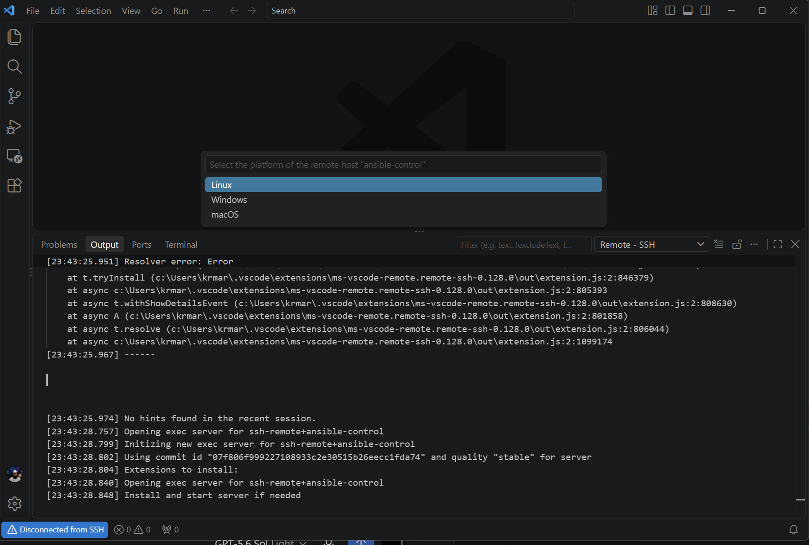
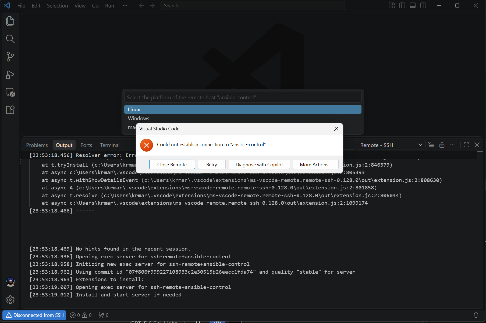
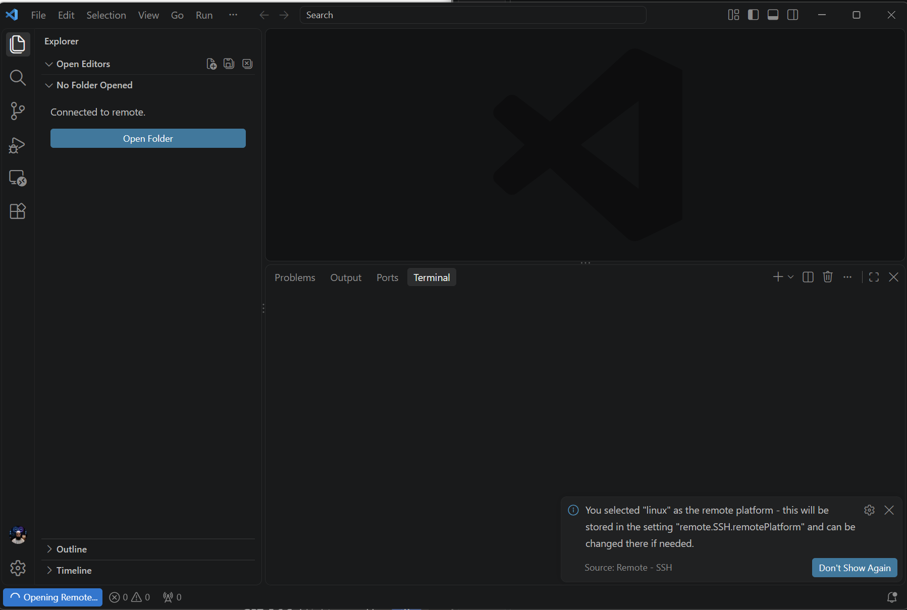
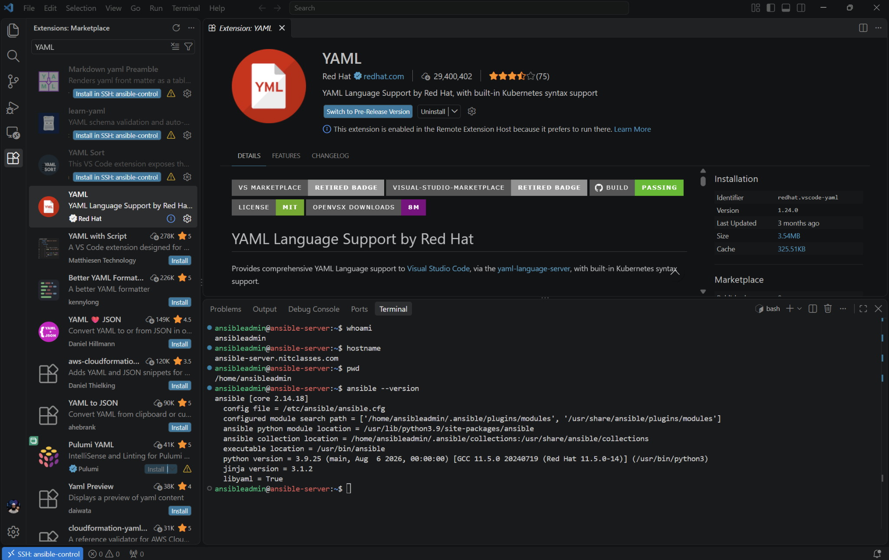
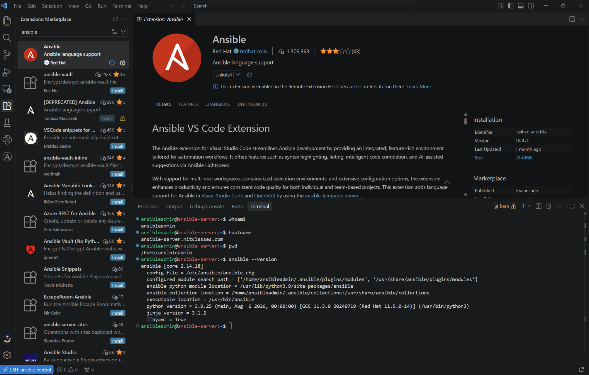
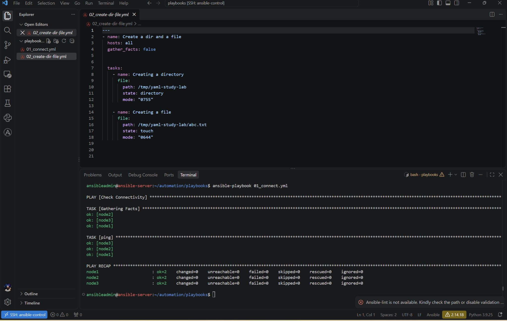

# VS Code, SCP, and Remote SSH for an Ansible Control Node

## Table of contents

1. [Lab environment](#1-lab-environment)
2. [Method 1 — Write locally and transfer with SCP](#2-method-1--write-locally-and-transfer-with-scp)
3. [Method 2 — Edit directly with VS Code Remote SSH](#3-method-2--edit-directly-with-vs-code-remote-ssh)
4. [The error that occurred](#4-the-error-that-occurred)
5. [Correct the Windows SSH configuration](#5-correct-the-windows-ssh-configuration)
6. [Test SSH before opening VS Code](#6-test-ssh-before-opening-vs-code)
7. [Connect from VS Code](#7-connect-from-vs-code)
8. [Install extensions on the remote host](#8-install-extensions-on-the-remote-host)
9. [Open the Ansible project and create a playbook](#9-open-the-ansible-project-and-create-a-playbook)
10. [Validate and run a playbook](#10-validate-and-run-a-playbook)
11. [SCP versus Remote SSH](#11-scp-versus-remote-ssh)
12. [Troubleshooting](#12-troubleshooting)
13. [Security and best practices](#13-security-and-best-practices)
14. [Quick command reference](#14-quick-command-reference)

---

## 1. Lab environment

| Item | Value |
|---|---|
| Windows account | `krmar` |
| Ansible control node | `192.168.1.233` |
| SSH user | `ansibleadmin` |
| SSH alias | `ansible-control` |
| Remote home | `/home/ansibleadmin` |
| Ansible project | `/home/ansibleadmin/automation` |
| Operating system selected in VS Code | Linux |

The Windows computer runs VS Code. Ansible itself runs on the Rocky Linux control node.

---

## 2. Method 1 — Write locally and transfer with SCP

This is the basic workflow: create or edit a YAML file on Windows, copy it to the control node, and then run it through SSH.

### Step 1: Create a local working directory

Run in Windows PowerShell:

```powershell
New-Item -ItemType Directory -Force "$HOME\Documents\ansible-playbooks"
Set-Location "$HOME\Documents\ansible-playbooks"
code .
```

Create a file such as `create-study-file.yml` in VS Code.

### Step 2: Check the playbook filename

```powershell
Get-ChildItem
```

Make sure Windows did not silently add `.txt`. The filename should end in `.yml` or `.yaml`.

### Step 3: Copy one playbook to the control node

```powershell
scp .\create-study-file.yml ansibleadmin@192.168.1.233:/home/ansibleadmin/automation/playbooks/
```

The general syntax is:

```text
scp SOURCE USER@SERVER:DESTINATION
```

If the destination directory does not exist, create it first:

```powershell
ssh ansibleadmin@192.168.1.233 "mkdir -p /home/ansibleadmin/automation/playbooks"
```

### Step 4: Copy an entire local folder

```powershell
scp -r .\playbooks ansibleadmin@192.168.1.233:/home/ansibleadmin/automation/
```

`-r` means recursive; it copies the directory and everything inside it.

### Step 5: Verify the transferred file

```powershell
ssh ansibleadmin@192.168.1.233
```

Then run on the control node:

```bash
ls -l /home/ansibleadmin/automation/playbooks
sed -n '1,120p' /home/ansibleadmin/automation/playbooks/create-study-file.yml
```

### Step 6: Copy a corrected file back to Windows if needed

```powershell
scp ansibleadmin@192.168.1.233:/home/ansibleadmin/automation/playbooks/create-study-file.yml .
```

SCP works well for occasional transfers, but every edit requires another copy. Remote SSH is more convenient for regular practice.

---

## 3. Method 2 — Edit directly with VS Code Remote SSH

Remote SSH lets the local VS Code interface open a directory located on the Linux control node. Files are saved directly on Linux, and VS Code's integrated terminal also runs on that node.

### Requirements

- Windows OpenSSH client
- VS Code
- Microsoft **Remote - SSH** extension
- Working network connection to `192.168.1.233` on TCP port 22
- A valid Linux account, here `ansibleadmin`
- Password authentication or, preferably, a valid SSH key
- `tar` and `gzip` installed on the Rocky Linux control node

Check Windows OpenSSH:

```powershell
ssh -V
```

Check the SSH port:

```powershell
Test-NetConnection 192.168.1.233 -Port 22
```

`TcpTestSucceeded : True` means that Windows can reach the SSH service.

### Install the required archive utilities on Rocky Linux

Before the first VS Code Remote SSH connection, sign in to the control node and install `tar` and `gzip`:

```bash
sudo dnf install -y tar gzip
```

Why these packages are needed:

- `tar` extracts the VS Code Server archive on the remote Linux machine.
- `gzip` handles gzip-compressed archive data.
- `-y` automatically answers **yes** to the DNF confirmation prompt.

Verify both commands:

```bash
tar --version
gzip --version
```

If these tools are missing, Remote SSH may connect through SSH but fail while installing or extracting the VS Code Server component.

---

## 4. The error that occurred

The first command returned:

```text
ssh: Could not resolve hostname ansible-control: No such host is known.
```

The Windows SSH directory showed this file:

```text
config.txt
```

OpenSSH expects the file to be named exactly:

```text
config
```

It does not automatically treat `config.txt` as its SSH configuration. Therefore, the alias `ansible-control` was unknown and Windows tried to resolve it like a DNS hostname.

### Fix the filename

```powershell
Rename-Item "$HOME\.ssh\config.txt" "config"
```

Verify it:

```powershell
Get-ChildItem "$HOME\.ssh\config"
Get-Content "$HOME\.ssh\config"
```

### Why Notepad caused this

Notepad may append `.txt` when a file is saved as a text document. To avoid that, select **All files** in the Save As dialog and save the name as `config`, or rename it afterward with PowerShell.

---

## 5. Correct the Windows SSH configuration

Open the file:

```powershell
notepad "$HOME\.ssh\config"
```

Use:

```sshconfig
Host ansible-control
    HostName 192.168.1.233
    User ansibleadmin
    IdentityFile C:/Users/krmar/.ssh/id_ed25519
    IdentitiesOnly yes
```

### Line-by-line explanation

| Line | Meaning |
|---|---|
| `Host ansible-control` | Creates a convenient local alias. |
| `HostName 192.168.1.233` | Gives the real IP address of the control node. |
| `User ansibleadmin` | Sets the remote Linux login user. |
| `IdentityFile .../id_ed25519` | Selects the Windows private key to use. |
| `IdentitiesOnly yes` | Tells SSH to offer the configured key instead of trying many unrelated keys. |

### Important correction from the original setup

The original configuration referenced:

```text
C:/Users/krmar/.ssh/ansible-key
```

But this test returned `False`:

```powershell
Test-Path "$HOME\.ssh\ansible-key"
```

The directory contained `id_ed25519`, not `ansible-key`. The `IdentityFile` must point to a private key that actually exists and whose matching public key is present in the remote user's `~/.ssh/authorized_keys` file.

Confirm the corrected path:

```powershell
Test-Path "$HOME\.ssh\id_ed25519"
```

Expected result:

```text
True
```

> A login may still work with a missing `IdentityFile` if SSH falls back to another loaded key or password authentication. That does not make the incorrect path valid.

### If the public key has not been installed

Windows does not always include `ssh-copy-id`. This PowerShell command appends the public key to the remote account:

```powershell
Get-Content "$HOME\.ssh\id_ed25519.pub" | ssh ansibleadmin@192.168.1.233 "umask 077; mkdir -p ~/.ssh; cat >> ~/.ssh/authorized_keys"
```

You will normally enter the account password once. Then test key authentication.

---

## 6. Test SSH before opening VS Code

Always prove that ordinary SSH works first:

```powershell
ssh ansible-control
```

Check how SSH interprets the alias:

```powershell
ssh -G ansible-control | Select-String "hostname|user|identityfile"
```

Expected important lines:

```text
user ansibleadmin
hostname 192.168.1.233
identityfile C:/Users/krmar/.ssh/id_ed25519
```

For detailed troubleshooting:

```powershell
ssh -vvv ansible-control
```

Exit the Linux session with:

```bash
exit
```

If `ssh ansible-control` fails, fix SSH first. VS Code Remote SSH depends on the same SSH configuration.

---

## 7. Connect from VS Code

1. Install the Microsoft **Remote - SSH** extension locally in VS Code.
2. Press `Ctrl+Shift+P`.
3. Run **Remote-SSH: Connect to Host...**.
4. Select `ansible-control`.
5. When asked for the remote platform, select **Linux**.
6. Accept the host key only after confirming that it belongs to the correct server.
7. Enter the password if key authentication is not yet configured.
8. Wait while VS Code installs/starts its server component on the control node.

### Screenshot 1 — Select Linux as the remote platform



### Screenshot 2 — Initial connection failure



This error screen is not specific enough to identify the root cause by itself. The reliable diagnostic is to run `ssh ansible-control` and then `ssh -vvv ansible-control` in PowerShell.

### Screenshot 3 — Successful remote connection



The lower-left status indicator should show `SSH: ansible-control`. **Connected to remote** confirms that VS Code is operating against the Linux control node.

---

## 8. Install extensions on the remote host

Extensions that analyze Linux files or run Linux commands may need to be installed in the remote extension host, even if they are already installed locally.

Recommended extensions:

- **YAML** by Red Hat
- **Ansible** by Red Hat

In the Extensions view, look for a button such as:

```text
Install in SSH: ansible-control
```

### Screenshot 4 — YAML support on the remote host



### Screenshot 5 — Ansible support on the remote host



The screenshots also show commands in the integrated remote terminal:

```bash
whoami
hostname
pwd
ansible --version
```

These verify that the terminal is using `ansibleadmin` on `ansible-server.nitclasses.com`, not the Windows computer.

### Configure Ansible Lint on Rocky Linux 9

The Red Hat Ansible extension can validate an open playbook with `ansible-lint`. Installing the VS Code extension does **not** automatically install the `ansible-lint` command on the remote Linux control node.

The following VS Code notification means that the extension cannot find the executable:

```text
Ansible-lint is not available. Kindly check the path or disable validation.
```



#### The first installation attempt and its error

The initial command was:

```bash
sudo dnf install -y ansible-lint
```

Rocky Linux reported a dependency problem similar to:

```text
package python3-ansible-lint ... from epel requires python3.9dist(rich)
nothing provides python3.9dist(pygments) ... needed by python3-rich ... from epel
```

This means DNF found `ansible-lint` in EPEL, but it could not find the required `python3-pygments` dependency in the currently enabled repositories. On Rocky Linux 9, EPEL packages can depend on packages provided through the **CRB (CodeReady Builder)** repository.

> Do not use `--skip-broken` as the solution. It would skip the package that cannot be installed rather than provide the missing dependency.

#### Step 1: Install the repository-management plugin

```bash
sudo dnf install -y dnf-plugins-core
```

This package provides the `dnf config-manager` command.

#### Step 2: Enable the Rocky Linux 9 CRB repository

```bash
sudo dnf config-manager --set-enabled crb
```

#### Step 3: Confirm that CRB and EPEL are enabled

```bash
sudo dnf repolist --enabled | grep -E 'crb|epel'
```

The results should include `crb` and at least the main `epel` repository.

#### Step 4: Refresh DNF metadata

```bash
sudo dnf clean all
sudo dnf makecache
```

`dnf clean all` removes cached repository metadata. `dnf makecache` downloads fresh metadata from all enabled repositories.

#### Step 5: Install the previously missing dependency

```bash
sudo dnf install -y python3-pygments
```

This step confirms that the package is now available through the enabled repository set.

#### Step 6: Install Ansible Lint

```bash
sudo dnf install -y ansible-lint
```

#### Step 7: Verify the executable

```bash
ansible-lint --version
command -v ansible-lint
```

For an RPM installation, the executable will normally be found at:

```text
/usr/bin/ansible-lint
```

#### Step 8: Test the playbook from the terminal

```bash
cd /home/ansibleadmin/automation/playbooks
ansible-lint 02_create-dir-file.yml
```

Also run Ansible's built-in syntax validation:

```bash
ansible-playbook --syntax-check 02_create-dir-file.yml
```

These commands perform different checks:

| Command | Purpose |
|---|---|
| `ansible-playbook --syntax-check` | Checks whether Ansible can parse the playbook structure and syntax. |
| `ansible-lint` | Checks style, maintainability, risky practices, naming conventions, and other recommended rules. |

#### Step 9: Reload the VS Code remote window

1. Press `Ctrl+Shift+P`.
2. Run **Developer: Reload Window**.
3. Reopen `02_create-dir-file.yml`.

VS Code should now locate the remote `ansible-lint` executable and remove the “not available” notification.

#### Optional: Continue using short module names

Ansible Lint may recommend the Fully Qualified Collection Name (FQCN):

```yaml
ansible.builtin.file:
```

Your shorter form is still valid with the current Ansible environment:

```yaml
file:
```

Because this lab intentionally uses short module names for faster typing and beginner practice, create `/home/ansibleadmin/automation/.ansible-lint` with:

```yaml
---
skip_list:
  - fqcn
```

Create it from the terminal if desired:

```bash
cd /home/ansibleadmin/automation
printf '%s\n' '---' 'skip_list:' '  - fqcn' > .ansible-lint
```

Run the linter again from the project directory so it finds the configuration:

```bash
cd /home/ansibleadmin/automation
ansible-lint playbooks/02_create-dir-file.yml
```

This suppresses only the FQCN rule; other useful lint checks remain active.

---

## 9. Open the Ansible project and create a playbook

After connecting:

1. Select **Open Folder**.
2. Enter `/home/ansibleadmin/automation`.
3. Trust the folder only if it is your own lab project.
4. Open or create the `playbooks` directory.
5. Create a YAML file such as `create-study-file.yml`.

Example playbook:

```yaml
---
- name: Create a study file on managed nodes
  hosts: three_tier_app
  gather_facts: false

  tasks:
    - name: Ensure the lab directory exists
      file:
        path: /tmp/yaml-study-lab
        state: directory
        mode: "0755"

    - name: Create a study file
      copy:
        content: |
          YAML is a data format.
          Ansible uses YAML to structure playbooks.
          Inventory host: {{ inventory_hostname }}
        dest: /tmp/yaml-study-lab/notes.txt
        mode: "0644"
```

Save with `Ctrl+S`. Because this is a Remote SSH window, the file is saved directly on the Linux server; no SCP step is required.

---

## 10. Validate and run a playbook

Use the VS Code integrated terminal while connected to the control node:

```bash
cd /home/ansibleadmin/automation
```

Confirm the active Ansible configuration:

```bash
ansible --version
ansible-config dump --only-changed
```

Check the inventory:

```bash
ansible-inventory --graph
ansible three_tier_app --list-hosts
ansible three_tier_app -m ping
```

Check YAML/Ansible syntax without executing tasks:

```bash
ansible-playbook --syntax-check playbooks/create-study-file.yml
```

Preview likely changes where supported:

```bash
ansible-playbook --check --diff playbooks/create-study-file.yml
```

Run it:

```bash
ansible-playbook playbooks/create-study-file.yml
```

Run it with verbose information when troubleshooting:

```bash
ansible-playbook -v playbooks/create-study-file.yml
```

Verify the result:

```bash
ansible three_tier_app -m command -a "cat /tmp/yaml-study-lab/notes.txt"
```

Run the playbook again to observe idempotency. If the desired state already exists, idempotent modules normally report `changed=0`.

---

## 11. SCP versus Remote SSH

| Feature | SCP workflow | VS Code Remote SSH |
|---|---|---|
| Where editing occurs | Windows | Linux control node through VS Code |
| Transfer after every edit | Yes | No |
| Linux paths and permissions | Checked after transfer | Used directly |
| Remote terminal | Separate SSH session | Built into VS Code |
| Best use | Occasional copy or backup | Regular Ansible lab work |
| Main risk | Copying the wrong version/direction | Editing the live remote file accidentally |

Recommendation: use Remote SSH for normal practice, and use SCP when you intentionally need to transfer, back up, or submit files.

---

## 12. Troubleshooting

### `Could not resolve hostname ansible-control`

Likely cause: the SSH alias was not loaded because the file was named `config.txt`, was stored in the wrong directory, or contained a syntax error.

```powershell
Get-ChildItem "$HOME\.ssh" -Force
Get-Content "$HOME\.ssh\config"
ssh -G ansible-control | Select-String "hostname|user|identityfile"
```

### `Identity file ... not accessible`

The configured private-key path is wrong.

```powershell
Test-Path "$HOME\.ssh\id_ed25519"
```

Point `IdentityFile` to the real private key. Do not point it to the `.pub` file.

### `Permission denied (publickey,password)`

Possible causes include:

- wrong username;
- public key not present in `/home/ansibleadmin/.ssh/authorized_keys`;
- incorrect ownership or permissions;
- server authentication policy rejects the selected method.

On the server, verify:

```bash
chmod 700 ~/.ssh
chmod 600 ~/.ssh/authorized_keys
chown -R ansibleadmin:ansibleadmin ~/.ssh
```

### `Connection refused`

The IP is reachable, but nothing is accepting the connection on port 22, or a firewall is actively rejecting it. Check from the server console:

```bash
sudo systemctl status sshd --no-pager
sudo ss -ltnp | grep ':22'
sudo firewall-cmd --list-services
```

If appropriate:

```bash
sudo systemctl enable --now sshd
sudo firewall-cmd --permanent --add-service=ssh
sudo firewall-cmd --reload
```

### Connection times out

Check the IP address, LAN/VLAN path, VM networking, and firewall:

```powershell
ping 192.168.1.233
Test-NetConnection 192.168.1.233 -Port 22
```

### Host key changed

First verify that the VM was rebuilt or that the server key legitimately changed. Then remove only the old entry:

```powershell
ssh-keygen -R 192.168.1.233
```

Reconnect and verify the new fingerprint before accepting it.

### VS Code fails although PowerShell SSH works

1. In VS Code, open **View → Output**.
2. Select **Remote - SSH** from the output list.
3. Confirm VS Code is using the expected SSH configuration and host alias.
4. Confirm that `tar` and `gzip` are installed:

```bash
sudo dnf install -y tar gzip
```

5. Run **Remote-SSH: Kill VS Code Server on Host...** and reconnect if the remote server installation is stuck.
6. Ensure the remote account can write to its home directory and has enough disk space:

```bash
df -h
df -i
ls -ld /home/ansibleadmin
```

### `Ansible-lint is not available`

First confirm whether the command exists on the remote control node:

```bash
command -v ansible-lint
ansible-lint --version
```

If it is missing and DNF reports a `python3-pygments` dependency error, enable CRB and reinstall:

```bash
sudo dnf install -y dnf-plugins-core
sudo dnf config-manager --set-enabled crb
sudo dnf clean all
sudo dnf makecache
sudo dnf install -y python3-pygments
sudo dnf install -y ansible-lint
```

Then use **Developer: Reload Window** in VS Code.

---

## 13. Security and best practices

- Never copy or publish a private key such as `id_ed25519`.
- Only the public key (`id_ed25519.pub`) should be placed in `authorized_keys`.
- Verify host fingerprints before accepting a first connection.
- Prefer key authentication over repeatedly entering a password.
- Keep playbooks in Git so changes can be reviewed and recovered.
- Run `--syntax-check` before execution.
- Use `--check --diff` when modules and tasks support check mode.
- Use `--limit node1` during initial testing before targeting all nodes.
- Be careful when editing files directly on the control node; changes are immediate.
- Do not open or trust unknown remote folders in VS Code.

---

## 14. Quick command reference

### Windows PowerShell

```powershell
# List SSH files
Get-ChildItem "$HOME\.ssh" -Force

# Rename config.txt to config
Rename-Item "$HOME\.ssh\config.txt" "config"

# Read SSH configuration
Get-Content "$HOME\.ssh\config"

# Confirm private key exists
Test-Path "$HOME\.ssh\id_ed25519"

# Show resolved SSH options
ssh -G ansible-control | Select-String "hostname|user|identityfile"

# Test SSH
ssh ansible-control

# Debug SSH
ssh -vvv ansible-control

# Copy a playbook to Linux
scp .\playbook.yml ansible-control:/home/ansibleadmin/automation/playbooks/

# Copy a playbook from Linux to Windows
scp ansible-control:/home/ansibleadmin/automation/playbooks/playbook.yml .
```

### Ansible control node

```bash
cd /home/ansibleadmin/automation
sudo dnf install -y tar gzip
sudo dnf install -y dnf-plugins-core
sudo dnf config-manager --set-enabled crb
sudo dnf install -y python3-pygments ansible-lint
ansible --version
ansible-lint --version
ansible-config dump --only-changed
ansible-inventory --graph
ansible three_tier_app -m ping
ansible-playbook --syntax-check playbooks/playbook.yml
ansible-lint playbooks/playbook.yml
ansible-playbook --check --diff playbooks/playbook.yml
ansible-playbook --limit node1 playbooks/playbook.yml
ansible-playbook playbooks/playbook.yml
```

---

## Final understanding

SCP and Remote SSH both use SSH, but they solve different problems:

- `scp` transfers file copies between Windows and Linux.
- VS Code Remote SSH opens the Linux environment directly for editing and terminal work.
- The alias `ansible-control` only works when Windows OpenSSH can read a correctly named `%USERPROFILE%\.ssh\config` file.
- `IdentityFile` must reference a real private key whose public key is authorized on the server.
- A successful `ssh ansible-control` test should come before troubleshooting VS Code.
