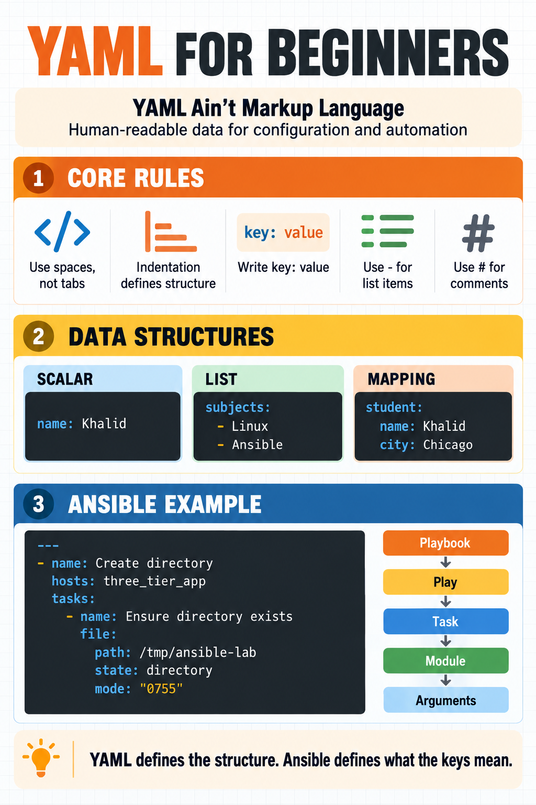

# YAML for Ansible Beginners - Study Notes




These notes explain YAML from scratch and connect every important concept to Ansible playbooks. 


## Index

1. [Learning objectives](#1-learning-objectives)
2. [What is YAML?](#2-what-is-yaml)
3. [What is a configuration file?](#3-what-is-a-configuration-file)
4. [Why YAML is popular](#4-why-yaml-is-popular)
5. [YAML, JSON, and XML](#5-yaml-json-and-xml)
6. [YAML file extensions](#6-yaml-file-extensions)
7. [Essential YAML rules](#7-essential-yaml-rules)
8. [Key-value pairs](#8-key-value-pairs)
9. [Scalar data types](#9-scalar-data-types)
10. [Strings and quotation marks](#10-strings-and-quotation-marks)
11. [Lists or sequences](#11-lists-or-sequences)
12. [Mappings or dictionaries](#12-mappings-or-dictionaries)
13. [Nested data](#13-nested-data)
14. [Lists of mappings](#14-lists-of-mappings)
15. [Comments](#15-comments)
16. [Multiline strings](#16-multiline-strings)
17. [YAML document markers](#17-yaml-document-markers)
18. [How YAML relates to Ansible](#18-how-yaml-relates-to-ansible)
19. [Ansible playbook structure](#19-ansible-playbook-structure)
20. [Understanding module values and arguments](#20-understanding-module-values-and-arguments)
21. [Practical Ansible example](#21-practical-ansible-example)
22. [Variables, lists, and loops](#22-variables-lists-and-loops)
23. [Booleans and file modes in Ansible](#23-booleans-and-file-modes-in-ansible)
24. [YAML versus tool-specific keywords](#24-yaml-versus-tool-specific-keywords)
25. [Validation methods](#25-validation-methods)
26. [Common errors and troubleshooting](#26-common-errors-and-troubleshooting)
27. [Hands-on practice lab](#27-hands-on-practice-lab)
28. [Practice questions with answers](#28-practice-questions-with-answers)
29. [Ansible dry run and Check Mode](#29-ansible-dry-run-and-check-mode)
30. [Ansible verbosity options](#30-ansible-verbosity-options)
31. [Quick-reference tables](#31-quick-reference-tables)
32. [Final summary](#32-final-summary)

---

## 1. Learning objectives

After completing these notes, you should be able to:

- Define YAML and explain its purpose.
- Explain how a configuration file controls software behavior.
- Recognize strings, integers, floating-point numbers, Booleans, null values, lists, and mappings.
- Use indentation correctly.
- Write nested YAML data.
- Explain how YAML represents an Ansible playbook.
- Identify plays, tasks, modules, and module arguments.
- Validate YAML and Ansible playbook syntax.
- Diagnose common YAML errors.

---

## 2. What is YAML?

YAML is a human-readable data-serialization format. It is commonly used to store structured data and write configuration files.

> Data serialization is the process of converting data into a structured, storable, and transferable format.

Examples of serialization formats include:
- YAML
- JSON
- XML
YAML represents data; it does not execute automation itself. Ansible reads the YAML and performs the specified automation.

The modern expansion of YAML is:

> YAML Ain't Markup Language

The name emphasizes that YAML represents data instead of describing document appearance like a traditional markup language.

### One-line definition

> YAML is a human-readable format used to organize structured data, especially in configuration files and automation tools.

YAML is not a programming language. It describes data that another program reads and interprets.

---

## 3. What is a configuration file?

A configuration file provides settings and instructions that control how a program or tool should behave.

For example, software may need to know:

- which port to use;
- which server to contact;
- which users are allowed;
- which services to start;
- which files to create;
- which hosts to configure.

The software contains the logic. The configuration file provides the selected settings.

### Simple analogy

Think of software as a driver and the configuration file as the route instructions. The driver can operate the vehicle, but the instructions tell the driver where to go.

In Ansible:

- Ansible is the automation engine.
- The inventory identifies the managed nodes.
- The playbook contains automation instructions.
- YAML provides the structure used to write those instructions.

---

## 4. Why YAML is popular

YAML is popular because it is:

- readable for humans;
- relatively easy to write;
- less visually cluttered than XML;
- suitable for nested data;
- supported by many modern DevOps tools;
- convenient for version control.

Tools that commonly use YAML include:

- Ansible;
- Docker Compose;
- Kubernetes;
- GitHub Actions;
- GitLab CI/CD;
- cloud deployment and infrastructure tools.

YAML being easy to read does not mean indentation is optional. YAML syntax must still be correct.

> Indentation uses spaces at the beginning of YAML lines to represent the structure and parent-child relationship of data.

---

## 5. YAML, JSON, and XML

The same structured data can often be represented using YAML, JSON, or XML.

### YAML

```yaml
student:
  name: Khalid
  course: Ansible
```

### JSON

```json
{
  "student": {
    "name": "Khalid",
    "course": "Ansible"
  }
}
```

### XML

```xml
<student>
  <name>Khalid</name>
  <course>Ansible</course>
</student>
```

| Format | Main characteristic |
|---|---|
| YAML | Uses indentation and has minimal visual punctuation |
| JSON | Uses braces, brackets, commas, and quoted keys |
| XML | Uses opening and closing tags |

YAML is often preferred for configuration because it is concise and readable. JSON is widely used by APIs. XML is still used in many established systems and document formats.

---

## 6. YAML file extensions

Both of these extensions are valid:

```text
.yml
.yaml
```

Examples:

```text
site.yml
deploy.yaml
```

Ansible accepts both extensions. Choose one naming convention and use it consistently within a project.

---

## 7. Essential YAML rules

### Rule 1: Use spaces, not tabs

YAML relies on indentation. Tabs can cause parser errors and inconsistent behavior.

Recommended style:

```yaml
student:
  name: Khalid
  course: Ansible
```

Two spaces per indentation level are common, but consistency is more important than the exact number.

### Rule 2: Indentation shows relationships

```yaml
student:
  name: Khalid
  course: Ansible
```

`name` and `course` belong to `student` because they are indented beneath it.

### Rule 3: Put a space after the colon

Correct:

```yaml
name: Khalid
```

Incorrect:

```yaml
name:Khalid
```

### Rule 4: Use a hyphen followed by a space for list items

```yaml
subjects:
  - Linux
  - Ansible
```

### Rule 5: Keep siblings aligned

```yaml
student:
  name: Khalid
  city: Chicago
```

`name` and `city` are at the same level, so they must have equal indentation.

### Rule 6: YAML is case-sensitive

These are different keys:

```yaml
name: Khalid
Name: Muhammad
```

### Rule 7: Do not repeat keys in the same mapping

Avoid:

```yaml
name: Khalid
name: Ahmed
```

Some parsers may silently keep only the last value, while others report an error. Use a list or separate mappings instead.

---

## 8. Key-value pairs

The most basic YAML structure is a key-value pair:

```yaml
key: value
```

Example:

```yaml
package: nginx
state: present
```

The key identifies the setting. The value contains its assigned data.

In this Ansible module example:

```yaml
dnf:
  name: nginx
  state: present
```

- `dnf` is the module name.
- The indented mapping is the value of `dnf`.
- `name` and `state` are arguments passed to the module.

---

## 9. Scalar data types

A scalar is a single value rather than a collection.

### String

```yaml
name: Khalid Khan
```

### Integer

```yaml
age: 25
```

### Floating-point number

```yaml
version: 1.5
```

### Boolean

```yaml
enabled: true
```

### Null

```yaml
optional_value: null
```

| Data type | Example | Meaning |
|---|---|---|
| String | `course: Ansible` | Text |
| Integer | `students: 25` | Whole number |
| Float | `version: 1.5` | Decimal number |
| Boolean | `enabled: true` | True or false |
| Null | `value: null` | No assigned value |

---

## 10. Strings and quotation marks

Plain strings often do not require quotation marks:

```yaml
name: Khalid Khan
```

Quotation marks are useful when:

- the string contains characters with YAML meaning;
- leading or trailing spaces matter;
- the value resembles a number or Boolean;
- a Jinja expression begins the value;
- you want to avoid ambiguity.

Example with a colon:

```yaml
message: "Warning: authorized access only"
```

Example preserving a numeric-looking string:

```yaml
postal_code: "01234"
```

Example containing a Jinja expression:

```yaml
path: "{{ lab_directory }}"
```

### Single versus double quotes

```yaml
single_quoted: 'Hello\nWorld'
double_quoted: "Hello\nWorld"
```

In a double-quoted string, `\n` can represent a newline. In a single-quoted YAML string, it normally remains literal text.

---

## 11. Lists or sequences

A list stores multiple ordered values.

### Block format

```yaml
subjects:
  - Linux
  - Ansible
  - Docker
```

Each hyphen represents one list item.

### Inline format

```yaml
subjects: [Linux, Ansible, Docker]
```

Both formats are valid. Block format is normally clearer for playbooks.

### Ansible package list

```yaml
dnf:
  name:
    - git
    - curl
    - tree
  state: present
```

Here, the value of `name` is a list containing three package names.

---

## 12. Mappings or dictionaries

A mapping stores related key-value pairs.

```yaml
student:
  name: Khalid
  city: Chicago
  course: Ansible
```

In programming terminology, this structure may also be called a dictionary, object, or associative array.

### Ansible example

```yaml
file:
  path: /tmp/ansible-lab
  state: directory
  mode: "0755"
```

The value of `file` is a mapping containing the module arguments `path`, `state`, and `mode`.

---

## 13. Nested data

YAML can contain mappings inside mappings.

```yaml
student:
  name: Khalid
  marks:
    Linux: 90
    Ansible: 85
```

Relationship:

```text
student
├── name
└── marks
    ├── Linux
    └── Ansible
```

Every deeper level is indented further.

### Multiple students using nested mappings

```yaml
students:
  student1:
    name: Khalid
    course: Ansible
  student2:
    name: Ahmed
    course: Linux
```

This avoids repeating the same key at one mapping level.

---

## 14. Lists of mappings

A list of mappings is useful when each list item has multiple properties.

```yaml
students:
  - name: Khalid
    course: Ansible
    city: Chicago
  - name: Ahmed
    course: Linux
    city: Dallas
```

Each hyphen starts one student mapping.

This structure is common in Ansible loops:

```yaml
users:
  - name: ali
    shell: /bin/bash
  - name: sara
    shell: /bin/bash
```

---

## 15. Comments

A comment begins with `#`:

```yaml
# Install the web-server package
package_name: nginx
```

Inline comment:

```yaml
state: present  # Ensure the package is installed
```

Comments help explain intent, but avoid comments that merely repeat obvious code.

Useful comment:

```yaml
# Quote the mode so YAML treats it as a string
mode: "0644"
```

---

## 16. Multiline strings

### Literal block using `|`

The pipe preserves line breaks:

```yaml
message: |
  Welcome to the Ansible lab.
  This file is managed automatically.
```

Result:

```text
Welcome to the Ansible lab.
This file is managed automatically.
```

### Folded block using `>`

The greater-than sign normally folds line breaks into spaces:

```yaml
message: >
  Welcome to the Ansible lab.
  This sentence will normally be folded.
```

This is useful for long readable lines in YAML.

### Ansible copy example

```yaml
copy:
  content: |
    WARNING: AUTHORIZED ACCESS ONLY.
    Activity may be monitored.
  dest: /tmp/banner.txt
  mode: "0644"
```

---

## 17. YAML document markers

`---` marks the start of a YAML document:

```yaml
---
- name: Example play
  hosts: all
```

`...` can mark the end of a document:

```yaml
...
```

Ansible does not require either marker in ordinary playbooks. Using `---` at the beginning is a common and clear convention. The ending marker is usually omitted.

---

## 18. How YAML relates to Ansible

YAML gives an Ansible playbook its data structure. Ansible gives specific meanings to keys such as:

- `name`;
- `hosts`;
- `become`;
- `gather_facts`;
- `vars`;
- `tasks`;
- `handlers`;
- `loop`;
- `when`;
- `register`;
- module names such as `file`, `copy`, and `dnf`.

YAML itself does not know what `hosts` or `tasks` means. Ansible reads the YAML and interprets those keys according to Ansible's rules.

This distinction is important:

> YAML defines the format; Ansible documentation defines the supported automation keywords and module arguments.

---

## 19. Ansible playbook structure

```yaml
---
- name: Create a lab directory
  hosts: three_tier_app
  become: false
  gather_facts: false

  tasks:
    - name: Ensure the lab directory exists
      file:
        path: /tmp/ansible-playbook-lab
        state: directory
        mode: "0755"
```

### Structure

```text
Playbook
└── Play
    ├── name
    ├── hosts
    ├── become
    ├── gather_facts
    └── tasks
        └── Task
            ├── name
            └── file module
                ├── path
                ├── state
                └── mode
```

### Definitions

| Term | Definition |
|---|---|
| Playbook | YAML file containing one or more plays |
| Play | Tasks applied to a host or inventory group |
| Task | One named unit of automation work |
| Module | Ansible component that performs an action |
| Argument | Value passed to a module to control its behavior |

---

## 20. Understanding module values and arguments

Consider:

```yaml
file:
  path: /tmp/ansible-playbook-lab
  state: directory
  mode: "0755"
```

It may appear that `file:` has no value on the same line. However, its value is the complete indented mapping beneath it:

```yaml
path: /tmp/ansible-playbook-lab
state: directory
mode: "0755"
```

Therefore:

- `file` is the module.
- `path`, `state`, and `mode` are arguments.
- The arguments mapping is the value of `file`.

### Module without arguments

Some modules can be called without arguments:

```yaml
- name: Test connectivity
  ping:
```

Here, `ping:` has no argument mapping, so its YAML value is empty or null.

### Module with arguments

```yaml
- name: Create a directory
  file:
    path: /tmp/demo
    state: directory
```

Here, `file:` is not blank. Its value is the indented arguments mapping.

### Recommended explanation

> A module does not always have a value on the same line. When arguments are indented below the module, those arguments collectively form the module's value.

---

## 21. Practical Ansible example

This example uses your Rocky Linux inventory group:

```yaml
---
- name: Create a study file on all managed nodes
  hosts: three_tier_app
  gather_facts: false

  tasks:
    - name: Ensure the lab directory exists
      file:
        path: /tmp/yaml-study-lab
        state: directory
        mode: "0755"

    - name: Create a study file
      copy:
        content: |
          YAML is a data format.
          Ansible uses YAML to structure playbooks.
          Inventory host: {{ inventory_hostname }}
        dest: /tmp/yaml-study-lab/notes.txt
        mode: "0644"
```

Play-level data:

- `name` is a string.
- `hosts` is a string containing an inventory pattern.
- `gather_facts` is a Boolean.
- `tasks` is a list.

Task-level data:

- Each `- name` begins a task mapping.
- `file` and `copy` are module names.
- Module arguments are nested mappings.
- `content: |` is a multiline string.

---

## 22. Variables, lists, and loops

```yaml
---
- name: Demonstrate variables and a loop
  hosts: three_tier_app
  gather_facts: false

  vars:
    lab_directory: /tmp/yaml-study-lab
    filenames:
      - introduction.txt
      - lists.txt
      - mappings.txt

  tasks:
    - name: Ensure the lab directory exists
      file:
        path: "{{ lab_directory }}"
        state: directory
        mode: "0755"

    - name: Create each study file
      file:
        path: "{{ lab_directory }}/{{ item }}"
        state: touch
        mode: "0644"
      loop: "{{ filenames }}"
```

Explanation:

- `vars` is a mapping.
- `lab_directory` is a string.
- `filenames` is a list.
- `tasks` is another list.
- `loop` reads the `filenames` list.
- `item` represents the current filename during each loop iteration.

> Note: `state: touch` updates file timestamps on repeated runs, so this particular task may continue to report changes. Use `copy` with stable content when you want a stronger idempotency demonstration.

---

## 23. Booleans and file modes in Ansible

### Use clear Boolean values

Recommended:

```yaml
become: true
gather_facts: false
enabled: true
```

Prefer lowercase `true` and `false`. They clearly represent Boolean values.

### Quote file modes

Recommended:

```yaml
mode: "0644"
```

```yaml
mode: "0755"
```

Quoting file modes avoids numeric interpretation problems and makes the intended permission notation clear.

---

## 24. YAML versus tool-specific keywords

Learning YAML teaches you how data is structured, but it does not automatically teach every key accepted by Ansible, Docker Compose, Kubernetes, or another tool.

For example:

```yaml
file:
  path: /tmp/demo
  state: directory
```

YAML explains:

- why `path` and `state` are nested under `file`;
- why a colon separates a key from its value;
- why indentation matters.

Ansible documentation explains:

- what the `file` module does;
- which arguments the module accepts;
- which values are valid for `state`;
- whether the module supports check mode;
- what the return values mean.

Use documentation:

```bash
ansible-doc file
ansible-doc copy
ansible-doc dnf
```

List installed modules:

```bash
ansible-doc -l
```

---

## 25. Validation methods

### Validate an Ansible playbook

```bash
ansible-playbook playbooks/example.yml --syntax-check
```

### List targeted hosts

```bash
ansible-playbook playbooks/example.yml --list-hosts
```

### List tasks

```bash
ansible-playbook playbooks/example.yml --list-tasks
```

### Preview supported changes

```bash
ansible-playbook playbooks/example.yml --check --diff
```

### Use a YAML-aware editor

Editors such as Vim with syntax support or Visual Studio Code with a YAML extension can highlight indentation and syntax problems.

### Security recommendation

Do not paste production playbooks containing passwords, private keys, tokens, internal hostnames, or confidential information into random online YAML validators.

---

## 26. Common errors and troubleshooting

### Error 1: Using tabs

Problem:

```text
found character '\t' that cannot start any token
```

Solution: replace tabs with spaces.

In Vim, show whitespace:

```vim
:set list
```

Convert tabs to spaces:

```vim
:set expandtab
:retab
```

### Error 2: Incorrect indentation

Incorrect:

```yaml
tasks:
  - name: Create directory
    file:
    path: /tmp/demo
      state: directory
```

Correct:

```yaml
tasks:
  - name: Create directory
    file:
      path: /tmp/demo
      state: directory
```

### Error 3: Missing space after a colon

Incorrect:

```yaml
name:Khalid
```

Correct:

```yaml
name: Khalid
```

### Error 4: A colon inside an unquoted string

Potentially confusing:

```yaml
message: Warning: authorized users only
```

Correct:

```yaml
message: "Warning: authorized users only"
```

### Error 5: Duplicate keys

Incorrect design:

```yaml
student: Khalid
student: Ahmed
```

Use a list:

```yaml
students:
  - Khalid
  - Ahmed
```

### Error 6: `mapping values are not allowed here`

This usually indicates:

- incorrect indentation;
- an unquoted colon;
- malformed key-value syntax.

### Error 7: `did not find expected '-' indicator`

This usually means a list item is missing a hyphen or list indentation is inconsistent.

### Error 8: Valid YAML but invalid Ansible

This can be valid YAML:

```yaml
favorite_color: blue
```

But it is not a valid Ansible playbook because it does not have the playbook structure Ansible expects.

Therefore, YAML validation and Ansible syntax validation are related but different checks.

---

## 27. Hands-on practice lab

### Objective

Create and run a safe Ansible playbook that demonstrates:

- a play;
- a task list;
- module argument mappings;
- variables;
- a list;
- a loop;
- multiline content;
- idempotency;
- cleanup.

### Step 1: Enter the project directory

```bash
cd /home/ansibleadmin/automation
mkdir -p playbooks
```

### Step 2: Verify the environment

```bash
ansible --version
ansible-inventory --graph
ansible three_tier_app -m ping
```

### Step 3: Create the playbook

```bash
vim playbooks/yaml-fundamentals-lab.yml
```

Add:

```yaml
---
- name: Practice YAML structures with Ansible
  hosts: three_tier_app
  gather_facts: false

  vars:
    lab_directory: /tmp/yaml-fundamentals-lab
    study_files:
      - name: strings.txt
        topic: YAML strings and quotation marks
      - name: lists.txt
        topic: YAML lists and loop items
      - name: mappings.txt
        topic: YAML mappings and nested arguments

  tasks:
    - name: Ensure the lab directory exists
      file:
        path: "{{ lab_directory }}"
        state: directory
        mode: "0755"

    - name: Create the study files
      copy:
        content: |
          YAML Study Lab
          Host: {{ inventory_hostname }}
          Topic: {{ item.topic }}
        dest: "{{ lab_directory }}/{{ item.name }}"
        mode: "0644"
      loop: "{{ study_files }}"

    - name: Verify the directory contents
      command: "ls -la {{ lab_directory }}"
      register: directory_listing
      changed_when: false

    - name: Display the verification output
      debug:
        var: directory_listing.stdout_lines
```

### Step 4: Check syntax

```bash
ansible-playbook playbooks/yaml-fundamentals-lab.yml --syntax-check
```

### Step 5: List hosts and tasks

```bash
ansible-playbook playbooks/yaml-fundamentals-lab.yml --list-hosts
ansible-playbook playbooks/yaml-fundamentals-lab.yml --list-tasks
```

### Step 6: Preview changes

```bash
ansible-playbook playbooks/yaml-fundamentals-lab.yml --check --diff
```

### Step 7: Run the playbook

```bash
ansible-playbook playbooks/yaml-fundamentals-lab.yml
```

### Step 8: Run it again

```bash
ansible-playbook playbooks/yaml-fundamentals-lab.yml
```

The second run should normally report `changed=0` because the desired files and content already exist.

### Step 9: Verify with an ad-hoc command

```bash
ansible three_tier_app -m command \
  -a "ls -la /tmp/yaml-fundamentals-lab"
```

### Step 10: Create a cleanup playbook

```bash
vim playbooks/yaml-fundamentals-cleanup.yml
```

Add:

```yaml
---
- name: Clean the YAML fundamentals lab
  hosts: three_tier_app
  gather_facts: false

  tasks:
    - name: Ensure the lab directory is absent
      file:
        path: /tmp/yaml-fundamentals-lab
        state: absent
```

Run it:

```bash
ansible-playbook playbooks/yaml-fundamentals-cleanup.yml
```

Run it again to test cleanup idempotency:

```bash
ansible-playbook playbooks/yaml-fundamentals-cleanup.yml
```

The second cleanup run should report `changed=0`.

---

## 28. Practice questions with answers

### 1. What does YAML stand for?

YAML stands for **YAML Ain't Markup Language**. It is a recursive acronym because the first letter refers to YAML itself.

### 2. Is YAML a programming language?

No. YAML is a human-readable **data-serialization language** used to represent structured data. It does not contain programming logic by itself.

### 3. Why are spaces important in YAML?

Spaces create indentation. YAML uses indentation to identify nesting, structure, and parent-child relationships.

### 4. Why should tabs be avoided?

YAML does not allow tabs for indentation. Tabs can cause parsing and syntax errors, so use spaces consistently.

### 5. What separates a key from its value?

A colon followed by a space (`: `) separates a key from its value.

```yaml
name: Khalid
```

### 6. What symbol begins a list item?

A hyphen followed by a space (`- `) begins each list item.

```yaml
packages:
  - nginx
  - git
```

### 7. What is the difference between a list and a mapping?

A list is an ordered collection of items. A mapping is a collection of key-value pairs.

### 8. When should a string be quoted?

Quote a string when it contains special characters, resembles a number or Boolean, or must preserve an exact format.

### 9. What does `|` do in a multiline string?

The literal block scalar `|` preserves line breaks.

### 10. What does `>` do in a multiline string?

The folded block scalar `>` usually converts line breaks into spaces and produces a paragraph.

### 11. What is the value of `file:` when arguments appear below it?

The value is not blank. The indented arguments collectively form the module's nested mapping value.

```yaml
file:
  path: /tmp/demo
  state: directory
  mode: "0755"
```

### 12. Why can `ping:` appear without arguments?

The Ansible `ping` module does not require arguments for its basic connectivity and Python test.

### 13. Is every valid YAML file a valid Ansible playbook?

No. A file can be valid YAML but still use an incorrect Ansible structure, keyword, module, or argument.

### 14. Where do Ansible-specific keywords come from?

Ansible defines keywords such as `hosts`, `tasks`, `become`, and `vars`, along with module names and their arguments. YAML only provides the data structure.

### 15. Which command checks Ansible playbook syntax?

```bash
ansible-playbook playbook.yml --syntax-check
```

### 16. Why should file modes such as `0644` be quoted?

Quoting preserves the exact permission format and prevents unintended numeric interpretation.

```yaml
mode: "0644"
```

### 17. What does `changed=0` on a second run normally demonstrate?

It normally demonstrates **idempotency**: the system is already in the desired state, so Ansible does not need to change it again.

### 18. Why should confidential playbooks not be pasted into unknown online validators?

Playbooks can contain usernames, IP addresses, tokens, passwords, keys, and infrastructure details. An unknown website could store or misuse that information.

---

## 29. Ansible dry run and Check Mode

### Definition

Ansible calls a dry run **Check Mode**. It predicts changes without applying them when the modules involved support Check Mode.

### Basic command

```bash
ansible-playbook playbook.yml --check
```

### Show proposed file differences

```bash
ansible-playbook playbook.yml --check --diff
```

- `--check` predicts what would change.
- `--diff` displays the before-and-after difference for supported modules.

### Run Check Mode against only `node1`

```bash
ansible-playbook playbook.yml --check --limit node1
```

### Specify the inventory explicitly

```bash
ansible-playbook -i ./inventory/nodes playbook.yml --check
```

### Ad-hoc Check Mode example

```bash
ansible three_tier_app -b -m dnf \
  -a "name=nginx state=present" --check
```

### Important limitations

- Not every module fully supports Check Mode.
- `command`, `shell`, and `raw` cannot reliably predict arbitrary command changes.
- Check Mode is a preview, not a guarantee that the real run will succeed.
- A later task may fail in Check Mode if it depends on a file or resource that an earlier task would have created.
- `--syntax-check` validates playbook syntax; it is not a dry run.

### Recommended validation workflow

```bash
ansible-playbook playbook.yml --syntax-check
ansible-playbook playbook.yml --check --diff
ansible-playbook playbook.yml
ansible-playbook playbook.yml
```

The second real run should ideally report `changed=0` when the playbook is idempotent.

---

## 30. Ansible verbosity options

### Definition

Verbosity options show additional execution details. Add the letter `v` after an Ansible command; more `v` characters produce more detailed output.

| Option | Detail level | Recommended use |
|---|---|---|
| `-v` | Basic additional details | General learning and light troubleshooting |
| `-vv` | More task and connection details | Investigating variables or task behavior |
| `-vvv` | Detailed SSH and connection information | Diagnosing authentication, inventory, or SSH problems |
| `-vvvv` | Very detailed connection debugging | Deep troubleshooting only; output can be extensive |

### Playbook examples

```bash
ansible-playbook playbook.yml -v
ansible-playbook playbook.yml -vv
ansible-playbook playbook.yml -vvv
ansible-playbook playbook.yml -vvvv
```

### Ad-hoc example

```bash
ansible three_tier_app -m ping -vvv
```

### Combine verbosity with Check Mode

```bash
ansible-playbook playbook.yml --check --diff -vv
```

### Use it in this lab environment

```bash
ansible-playbook -i ./inventory/nodes playbooks/example.yml --check --diff -vv
```

> **Caution:** Verbose output may reveal hostnames, IP addresses, file paths, usernames, and connection details. Review it before sharing screenshots or logs publicly. Start with `-v` or `-vv`; use `-vvv` when diagnosing SSH or connection failures.

---

## 31. Quick-reference tables

### YAML symbols

| Symbol | Purpose | Example |
|---|---|---|
| `:` | Separates a key and value | `name: Khalid` |
| `-` | Starts a list item | `- Linux` |
| `#` | Starts a comment | `# Lab task` |
| `|` | Literal multiline string | Preserves line breaks |
| `>` | Folded multiline string | Usually folds line breaks into spaces |
| `---` | Starts a YAML document | First line of a playbook |
| `...` | Ends a YAML document | Optional |
| `{}` | Inline mapping | `{name: Khalid}` |
| `[]` | Inline list | `[Linux, Ansible]` |

### YAML structures

| Structure | Example |
|---|---|
| Scalar | `name: Khalid` |
| List | `subjects: [Linux, Ansible]` |
| Mapping | `student: {name: Khalid}` |
| Nested mapping | A mapping indented inside another mapping |
| List of mappings | Multiple `- name:` objects |

### Ansible structure

| Level | Common keys |
|---|---|
| Playbook | List of plays |
| Play | `name`, `hosts`, `become`, `gather_facts`, `vars`, `tasks` |
| Task | `name`, module name, `when`, `loop`, `register`, `notify` |
| Module value | Arguments mapping |
| Module arguments | `path`, `state`, `mode`, `name`, `enabled`, and others |

### Recommended validation sequence

```bash
ansible-inventory --graph
ansible three_tier_app -m ping
ansible-playbook playbooks/example.yml --syntax-check
ansible-playbook playbooks/example.yml --list-hosts
ansible-playbook playbooks/example.yml --list-tasks
ansible-playbook playbooks/example.yml --check --diff
ansible-playbook playbooks/example.yml --check --diff -vv
ansible-playbook playbooks/example.yml
ansible-playbook playbooks/example.yml
```

---

## 32. Final summary

- YAML is a human-readable data format widely used for configuration and automation.
- YAML uses indentation to express structure and relationships.
- Tabs should not be used for indentation.
- A colon separates a key from its value.
- A hyphen begins a list item.
- Scalars contain single values; lists contain ordered items; mappings contain key-value pairs.
- Quotation marks prevent ambiguous strings from being interpreted incorrectly.
- Ansible uses YAML as the structural format for playbooks.
- Ansible, not YAML, defines the meanings of `hosts`, `tasks`, modules, and module arguments.
- A module's indented arguments are collectively its value.
- A module such as `ping` can be used without arguments, but many modules require an arguments mapping.
- Validate playbooks with `ansible-playbook --syntax-check`.
- Preview supported changes with `--check` and inspect file differences with `--diff`.
- Use `-v` through `-vvvv` for progressively more detailed troubleshooting output.
- Run automation twice to examine idempotency.
- Keep a cleanup playbook so the lab can be practiced repeatedly.
